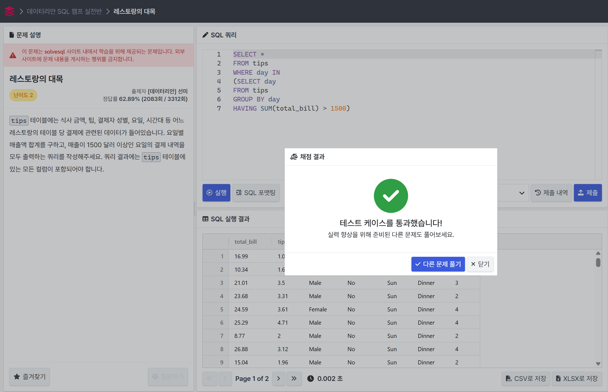
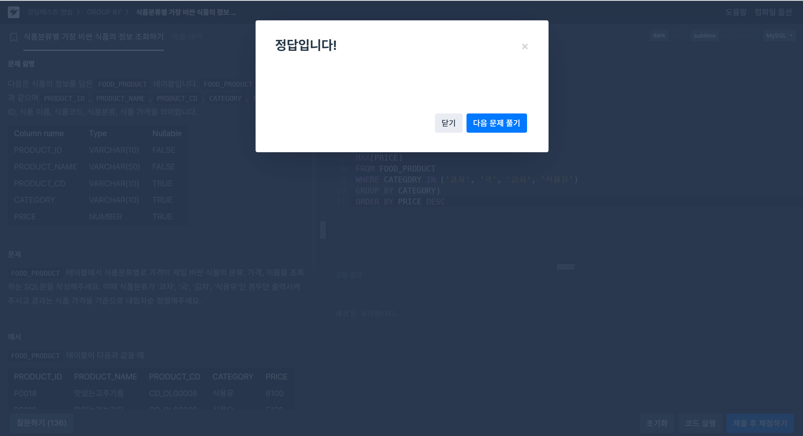
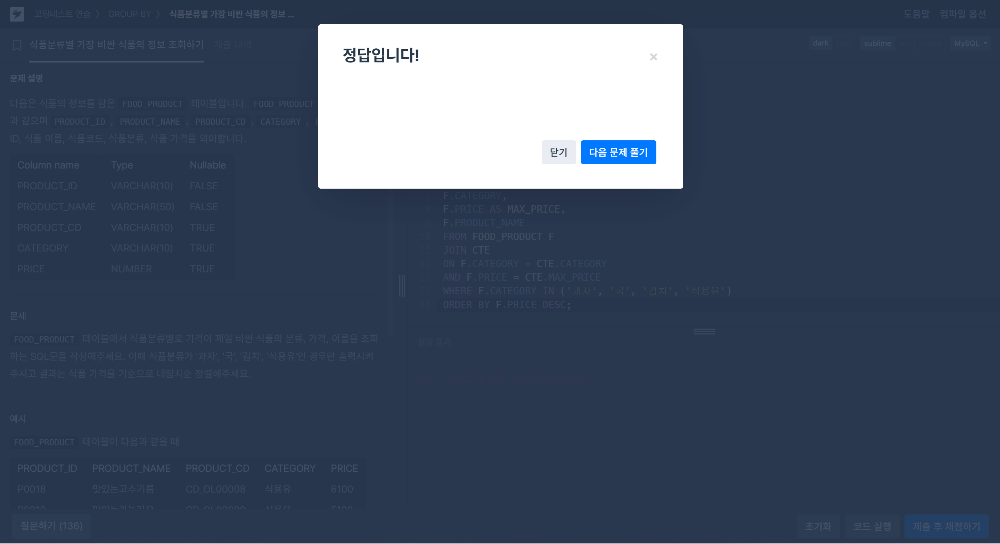

# SQL_Advanced Assignment 0주차

## 서브 쿼리

### 15.2.15 Subqueries
> SELECT 쿼리문 안에 포함되어 있는 또 하나의 별도 SELECT 쿼리문

```js
SELECT * FROM t1 WHERE column1 = (SELECT column1 FROM t2);

`SELECT * FROM t1`: 외부 쿼리
`(SELECT column1 FROM t2)`: 서브 쿼리
```

- 서브 쿼리는 일반적인 SELECT 쿼리문이 포함될 수 있는 대부분의 키워드나 절을 포함할 수 있음<br>*( DISTINCT, GROUP BY, ORDER BY, LIMIT, JOIN, 인덱스 힌트, UNION, 주석, 함수 등)*


### 15.2.15.2 Comparisons Using Subqueries
>서브 쿼리는 일반적인 비교 연산자와 함께 사용할 수 있음<br>`=`, `>`, `<`, `>=`, `<=`, `<>`, `!=`, `<=>`

```js
... WHERE 'a' = (SELECT column1 FROM t1)
```

---
**Like 연산자와 함께 사용할 수도 있음**
```js
non_subquery_operand LIKE (subquery)
```

---
```js
SELECT * FROM t1
WHERE column1 = (SELECT MAX(column2) FROM t2);
```
-> t2 테이블의 column2에서 최대값을 찾아 t1 테이블에서 해당 값과 같은 column1을 가진 행을 조회

---
**특정 값이 주어진 컬럼에서 두 번 이상 등장하는 경우 찾기**
```js
SELECT * FROM t1 AS t
WHERE 2 = (SELECT COUNT(*) FROM t1 WHERE t1.id = t.id);
```
-> t1 테이블에서 id 값이 두 번 이상 등장하는 행을 조회

---
- 서브 쿼리가 단일 값(스칼라)를 반환해야 하는 경우, 여러 값을 반환하면 오류 발생 가능
- 서브 쿼리와 비교하는 값이 행과 일치해야 할 경우, 동일한 개수의 값을 반환해야 함


### 15.2.15.3. Subqueries with ANY, IN or SOME
> `ANY`, `IN`, `SOME`을 활용한 서브 쿼리는 비교 연산과 함께 사용 가능함
>
>사용 가능한 비교 연산자: `=`, `>`, `<`, `>=`, `<=`, `<>`, `!=`

```js
operand comparison_operator ANY (subquery)
operand IN (subquery)
operand comparison_operator SOME (subquery)
```

---
```js
SELECT s1 FROM t1 WHERE s1 > ANY (SELECT s1 FROM t2);
```
-> t2에서 반환된 값 중 하나라도 s1보다 작은 값이 있다면 TRUE

---
**IN은 = ANY의 별칭으로 사용됨**
```js
SELECT s1 FROM t1 WHERE s1 IN (SELECT s1 FROM t2);
```
-> s1 값이 t2의 결과 중 하나라도 포함되면 TRUE

---
**SOME은 ANY의 별칭이며 같은 의미로 사용됨**
```js
SELECT s1 FROM t1 WHERE s1 <> SOME (SELECT s1 FROM t2);
```
-> s1 값이 t2에서 반환된 값 중 하나라도 다른 값이 있으면 TRUE

---
**NOT IN은 <> ALL과 동일한 의미를 가짐**
```js
SELECT s1 FROM t1 WHERE s1 NOT IN (SELECT s1 FROM t2);
```
-> s1이 t2에서 반환된 값 어느 것도 포함되지 않을 때 TRUE

---
**MySQL 8.0.19부터 TABLE 키워드를 사용하여 서브 쿼리 대체 가능**
```js
SELECT s1 FROM t1 WHERE s1 IN (TABLE t2);
```
-> t2가 단일 컬럼 테이블이라면 TABLE t2로 서브 쿼리를 대체 가능


### 15.2.15.4. Subqueries with ALL
> `ALL`을 활용하면 서브 쿼리에서 반환된 모든 값과 비교할 수 있음

```js
operand comparison_operator ALL (subquery)
```

---
```js
SELECT s1 FROM t1 WHERE s1 > ALL (SELECT s1 FROM t2);
```
-> t1.s1이 t2.s1의 모든 값보다 클 경우 TRUE

---
**테이블이 비어 있는 경우 ALL 조건은 항상 TRUE가 됨**
```js
SELECT * FROM t1 WHERE 1 > ALL (SELECT s1 FROM t2);
```
-> t2가 비어 있다면 TRUE

---
**NOT IN은 <> ALL과 동일한 의미를 가짐**
```js
SELECT s1 FROM t1 WHERE s1 NOT IN (SELECT s1 FROM t2);
```
-> s1이 t2에서 반환된 값 어느 것도 포함되지 않을 때 TRUE

---
**MySQL 8.0.19부터 TABLE 키워드를 사용하여 서브 쿼리 대체 가능**
```js
SELECT s1 FROM t1 WHERE s1 <> ALL (TABLE t2);
```
-> t2가 단일 컬럼 테이블이라면 TABLE t2로 서브 쿼리를 대체 가능


### 15.2.15.6. Subqueries with EXISTS or NOT EXISTS
> `EXISTS`는 서브 쿼리가 한 개 이상의 행을 반환하면 `TRUE`를 반환
>
> `NOT EXISTS`는 서브 쿼리가 행을 반환하지 않으면 `TRUE`를 반환

---
```js
SELECT column1 FROM t1 WHERE EXISTS (SELECT * FROM t2);
```
-> t2에 데이터가 하나라도 있으면 TRUE

---
**NOT EXISTS 예제**
```js
SELECT DISTINCT store_type FROM stores
WHERE NOT EXISTS (SELECT * FROM cities_stores
                  WHERE cities_stores.store_type = stores.store_type);
```
-> cities_stores에 존재하지 않는 store_type 조회

---
**MySQL 8.0.19부터 TABLE 키워드를 사용하여 서브 쿼리 대체 가능**
```js
SELECT column1 FROM t1 WHERE EXISTS (TABLE t2);
```


### 15.2.15.10. Subquery Errors
> 서브 쿼리를 사용할 때 발생할 수 있는 주요 오류:

---
**1. 지원되지 않는 서브 쿼리 구문**
- LIMIT과 함께 IN/ALL/ANY/SOME을 사용하는 서브 쿼리는 지원되지 않음
```js
SELECT * FROM t1 WHERE s1 IN (SELECT s2 FROM t2 ORDER BY s1 LIMIT 1);
```

**오류 메시지:**
```
ERROR 1235 (ER_NOT_SUPPORTED_YET): This version of MySQL doesn't yet support 'LIMIT & IN/ALL/ANY/SOME subquery'
```

---
**2. 잘못된 서브 쿼리 컬럼 개수**
- 서브 쿼리는 비교 연산에서 단일 컬럼을 반환해야 함
```js
SELECT (SELECT column1, column2 FROM t2) FROM t1;
```

**오류 메시지:**
```
ERROR 1241 (ER_OPERAND_COL): Operand should contain 1 column(s)
```

---
**3. 잘못된 서브 쿼리 행 개수**
- 서브 쿼리는 단일 값을 기대하는 곳에서 여러 행을 반환할 수 없음
```js
SELECT * FROM t1 WHERE column1 = (SELECT column1 FROM t2);
```
- t2가 여러 행을 반환하면 오류 발생
- **해결책:** ANY를 사용하여 다중 행 비교 가능

**수정된 예제:**
```js
SELECT * FROM t1 WHERE column1 = ANY (SELECT column1 FROM t2);
```

---
**4. 업데이트 대상 테이블을 서브 쿼리에서 사용하는 경우**
- 동일한 테이블을 업데이트하면서 서브 쿼리에서 조회하는 것은 허용되지 않음
```js
UPDATE t1 SET column2 = (SELECT MAX(column1) FROM t1);
```

**오류 메시지:**
```
ERROR 1093 (ER_UPDATE_TABLE_USED): You can't specify target table 't1' for update in FROM clause
```

**해결책:** Common Table Expression(CTE) 또는 Derived Table을 활용하여 문제 해결 가능

## CTE(공통 테이블 표현식)

### 15.2.20 WITH (Common Table Expressions)

> CTE(공통 테이블 표현식)는 임시 결과 집합으로, 하나의 SQL 문 내에서 정의되고 참조될 수 있음
>
> `WITH` 키워드를 사용하여 정의하며, 이후 SQL 문에서 여러 번 참조 가능
>
> CTE는 재귀(Recursive) CTE와 비재귀(Non-Recursive) CTE로 구분됨

```js
WITH cte_name AS (subquery)
SELECT * FROM cte_name;
```

---
```js
WITH employee_cte AS (
    SELECT department_id, AVG(salary) AS avg_salary
    FROM employees
    GROUP BY department_id
)
SELECT e.name, e.salary, cte.avg_salary
FROM employees e
JOIN employee_cte cte ON e.department_id = cte.department_id;
```
-> 각 부서별 평균 급여와 직원의 급여를 함께 조회

---
**다중 CTE 사용 가능**
```js
WITH
  cte1 AS (SELECT a, b FROM table1),
  cte2 AS (SELECT c, d FROM table2)
SELECT b, d FROM cte1 JOIN cte2 ON cte1.a = cte2.c;
```

---
- `WITH` 절은 다음과 같은 SQL 문에서 사용 가능:
    - `SELECT`, `UPDATE`, `DELETE`
    - 서브쿼리 내에서 사용 가능
    - `INSERT ... SELECT`, `CREATE VIEW ... SELECT` 등과 함께 사용 가능

**이름 충돌 문제 해결**
```js
-- 잘못된 예제
WITH cte1 AS (...), cte1 AS (...) SELECT ...;

-- 올바른 예제
WITH cte1 AS (...), cte2 AS (...) SELECT ...;
```


## 문제 풀이

### 문제 1

```js
SELECT *
FROM tips
WHERE total_bill >
(SELECT AVG(total_bill)
FROM tips)
```


---
### 문제 2

```js
SELECT *
FROM tips
WHERE day IN
(SELECT day
FROM tips
GROUP BY day
HAVING SUM(total_bill) > 1500)
```


---
### 문제 3
**Subquery 활용**

```js
SELECT CATEGORY, PRICE
AS MAX_PRICE, PRODUCT_NAME
FROM FOOD_PRODUCT
WHERE (CATEGORY, PRICE)
IN
(SELECT CATEGORY,
MAX(PRICE)
FROM FOOD_PRODUCT
WHERE CATEGORY IN ('과자', '국', '김치', '식용유')
GROUP BY CATEGORY)
ORDER BY PRICE DESC
```

---
**With 활용**

```js
WITH CTE AS
(SELECT CATEGORY, 
MAX(PRICE) AS MAX_PRICE
FROM FOOD_PRODUCT
GROUP BY CATEGORY)
SELECT 
F.CATEGORY, 
F.PRICE AS MAX_PRICE, 
F.PRODUCT_NAME
FROM FOOD_PRODUCT F
JOIN CTE 
ON F.CATEGORY = CTE.CATEGORY
AND F.PRICE = CTE.MAX_PRICE
WHERE F.CATEGORY IN ('과자', '국', '김치', '식용유')
ORDER BY F.PRICE DESC;
```
