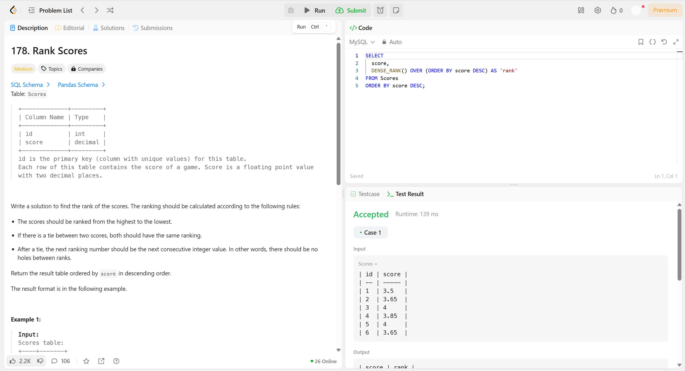
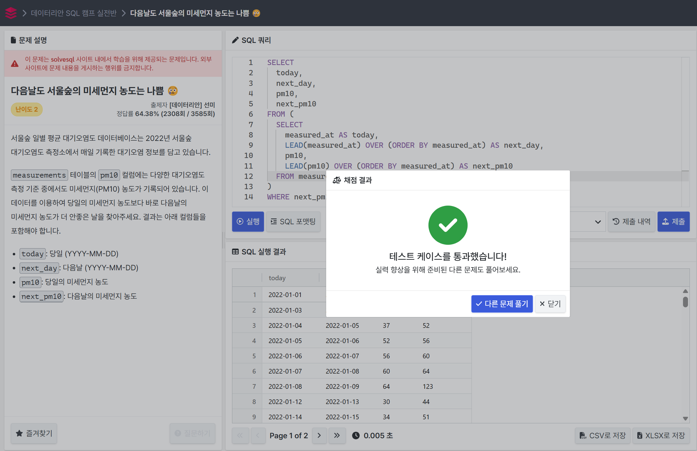
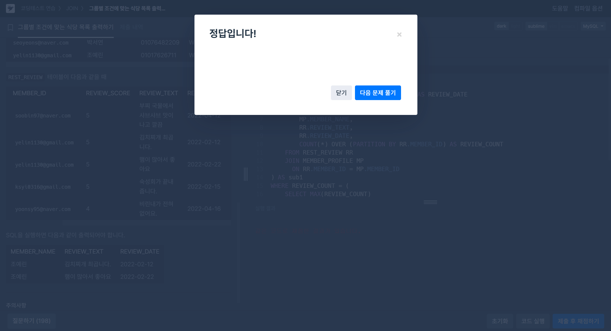

# SQL_Advanced Assignment 1주차

## 윈도우 함수

### 14.20.2. Window Function Concepts and Syntax

#### 윈도우 함수란?
- 집계 함수와 비슷하지만 결과를 "그룹별 하나의 행"으로 요약하는 대신, 각 행마다 결과를 반환
- 각 행을 기준 행으로 삼고, 그 기준을 포함한 윈도우(범위) 내에서 계산

---
#### 일반 집계 함수 (GROUP BY 사용):
```js
SELECT country, SUM(profit) FROM sales GROUP BY country
```
-> country별로 집계된 한 줄씩만 출력

#### 윈도우 함수 사용 (OVER절):
```js
SELECT year, country, product, profit,
       SUM(profit) OVER() AS total_profit,
       SUM(profit) OVER(PARTITION BY country) AS country_profit
FROM sales
```
-> 모든 행에 대해 전체 합, 나라별 합을 행별로 보여줌

---
**OVER() 구문**
- 윈도우 함수를 쓸 때 필수적으로 사용됨
```js
OVER (
  [PARTITION BY ...] -> 그룹 나누기
  [ORDER BY ...]     -> 정렬 기준
  [ROWS ...]         -> 프레임 지정 (선택사항)
)
```

**PARTITION BY**
- GROUP BY처럼 데이터를 그룹화함.
- *예)* `PARTITION BY country` -> 나라별로 나눔

**ORDER BY**
- 각 파티션 내에서 행의 정렬 기준을 정함
- 정렬하면 `ROW_NUMBER()` 등에서 순서를 일관되게 부여 가능
```js
SELECT year, country, product, profit,
       ROW_NUMBER() OVER(PARTITION BY country ORDER BY year, product) AS row_num
FROM sales;
```
-> 나라별로 연도와 제품 기준으로 정렬하고 행 번호를 부여

---
#### 윈도우 함수로 사용할 수 있는 함수들
- 일반 집계 함수 (OVER 사용 가능)<br>
`SUM()`, `AVG()`, `COUNT()`, `MAX()`, `MIN()` 등

- 전용 윈도우 함수 (OVER 필수)<br>
`ROW_NUMBER()`, `RANK()`, `DENSE_RANK()`, `LAG()`, `LEAD()`, `NTILE()`, `FIRST_VALUE()`, `LAST_VALUE()` 등

---
#### 윈도우 함수 사용 위치
- SELECT 절 또는 ORDER BY 절에서만 사용 가능
- WHERE, GROUP BY, HAVING에는 사용 불가


### 14.20.1. Window Function Descriptions

#### 윈도우 전용 함수 요약 (비집계 윈도우 함수)
- 각 행에 대해, 지정된 윈도우(범위) 내의 다른 행들과 연관된 계산을 수행함
- `OVER(...)` 절은 필수이며, `PARTITION BY`, `ORDER BY`, `ROWS` 등을 통해 범위를 지정할 수 있음

| 함수 이름               | 설명                                                                 |
|------------------------|----------------------------------------------------------------------|
| `ROW_NUMBER()`         | 파티션 내 행 번호를 부여 (동일값도 서로 다른 번호)                   |
| `RANK()`               | 순위를 매기되, 동일값은 같은 순위, 건너뜀 (1, 1, 3...)               |
| `DENSE_RANK()`         | 순위를 매기되, 동일값은 같은 순위, 건너뛰지 않음 (1, 1, 2...)        |
| `CUME_DIST()`          | 누적 분포 비율 (현재 행 이하 비율), 0~1 사이 실수                    |
| `PERCENT_RANK()`       | 상대 순위 백분율 = (rank-1)/(rows-1), 0~1                             |
| `NTILE(N)`             | 파티션을 N개로 나누고, 현재 행이 몇 번째 그룹인지 반환              |
| `FIRST_VALUE(expr)`    | 윈도우 프레임에서 첫 번째 행의 값                                    |
| `LAST_VALUE(expr)`     | 윈도우 프레임에서 마지막 행의 값                                     |
| `NTH_VALUE(expr, N)`   | 윈도우 프레임에서 N번째 행의 값                                      |
| `LAG(expr [, N, default])`  | 현재 행에서 N행 이전의 값을 반환 (없으면 기본값)                |
| `LEAD(expr [, N, default])` | 현재 행에서 N행 이후의 값을 반환 (없으면 기본값)                |

---
**순위 관련**
- `ROW_NUMBER()`: 각 행에 고유한 번호 (중복값도 순번 다름)
- `RANK()`: 동순위 부여 + 건너뜀
- `DENSE_RANK()`: 동순위 부여 + 건너뛰지 않음

**백분율 관련**
- `CUME_DIST()`: 누적 분포 비율 (자기 이하의 비율)
- `PERCENT_RANK()`: 상대 백분율 순위

**그룹 나누기**
- `NTILE(N)`: N개의 그룹으로 나누고 몇 번째 그룹인지 알려줌

**값 가져오기**
- `FIRST_VALUE()`, `LAST_VALUE()`: 프레임 기준 앞/뒤 값
- `NTH_VALUE()`: N번째 값
- `LAG()`, `LEAD()`: 앞뒤 행의 값 (비교나 차이 계산에 자주 사용)

---
- `OVER()` 절 필수
- `ORDER BY`를 반드시 설정해야 의미 있는 결과를 얻는 함수들이 많음
- `PARTITION BY`로 그룹을 나눌 수 있음 (없으면 전체가 하나의 파티션)
- `NULL` 처리 방식은 기본적으로 `RESPECT NULLS`만 허용됨 (MySQL은 `IGNORE NULLS` 지원 안 함)


### 14.20.4. Named Windows
- 윈도우 이름을 정의해서 재사용할 수 있도록 도와주는 기능
- 중복된 `OVER(...)` 정의를 줄이고, 쿼리 가독성과 유지보수성을 높일 수 있음

```js
WINDOW window_name AS (window_spec)
```
> - `window_name`: 윈도우 이름
> - `window_spec`: PARTITION BY, ORDER BY, ROWS 등 포함 가능<br>
(→ `OVER(...)` 괄호 안에서 쓰는 것과 동일한 구성)

- `WINDOW` 절은 쿼리에서 `HAVING` 절 뒤, `ORDER BY` 절 앞에 위치함

---
#### 중복 정의 없이 작성한 쿼리
```js
SELECT
  val,
  ROW_NUMBER() OVER w AS row_number,
  RANK()       OVER w AS rank,
  DENSE_RANK() OVER w AS dense_rank
FROM numbers
WINDOW w AS (ORDER BY val)
```
-> 세 개의 윈도우 함수가 동일한 윈도우 정의(`ORDER BY val`)를 공유하므로, `WINDOW w AS (...)`로 한 번만 정의해 사용함

#### 확장 정의도 가능
- 기존 정의에 속성 추가는 가능하지만, 같은 속성을 다시 정의하면 오류임

**가능한 예**
```js
SELECT
  FIRST_VALUE(year) OVER (w ORDER BY year ASC) AS first,
  FIRST_VALUE(year) OVER (w ORDER BY year DESC) AS last
FROM sales
WINDOW w AS (PARTITION BY country);
```
-> `w`는 `PARTITION BY country`만 포함<br>
-> `OVER`에서는 `ORDER BY`만 추가

**오류가 발생하는 예**
```js
SELECT ...
OVER (w PARTITION BY year) -> 오류!
WINDOW w AS (PARTITION BY country)
```
-> `PARTITION BY`가 중복되어 정의되므로 오류 발생

### 이름 간 참조 (재사용)
- 윈도우 이름끼리 앞뒤로 참조 가능
- 단, 순환 참조는 허용되지 않음

**허용 예 (순환 없음)**
```js
WINDOW w1 AS (w2), w2 AS (), w3 AS (w1)
```

**오류 예 (순환 참조 발생)**
```js
WINDOW w1 AS (w2), w2 AS (w3), w3 AS (w1)
```

---
- 중복되는 `OVER(...)` 정의를 한번만 선언하여 가독성 향상
- 윈도우 정의를 한 군데에서 관리 가능 -> 유지보수 용이
- 윈도우 정의를 재사용 및 확장 가능


### 14.19.1. Aggregate Function Descriptions

#### `OVER()` 절로 윈도우 함수처럼 사용할 수 있는 집계 함수 요약
| 함수 이름               | 설명                                                                 |
|-------------------------|-------------------------------------------------------------------|
| `AVG(expr)`             | 평균값 반환. `OVER()` 가능. `DISTINCT`와 함께는 사용 불가.         |
| `BIT_AND(expr)`         | 비트 AND. MySQL 8.0.12부터 `OVER()` 지원.                         |
| `BIT_OR(expr)`          | 비트 OR. MySQL 8.0.12부터 `OVER()` 지원.                          |
| `BIT_XOR(expr)`         | 비트 XOR. MySQL 8.0.12부터 `OVER()` 지원.                         |
| `COUNT(expr)`           | `NULL`이 아닌 값의 개수. `OVER()` 사용 가능.                      |
| `COUNT(*)`              | 전체 행 수 계산. `OVER()` 사용 가능.                              |
| `MAX(expr)`             | 최대값 반환. `OVER()` 사용 가능. `DISTINCT`는 사용 불가.           |
| `MIN(expr)`             | 최소값 반환. `OVER()` 사용 가능. `DISTINCT`는 사용 불가.           |
| `SUM(expr)`             | 합계 반환. `OVER()` 사용 가능. `DISTINCT`는 사용 불가.             |
| `STD()`                 | 전체 집단의 표준편차 (`STDDEV_POP()`과 동일). `OVER()` 사용 가능.  |
| `STDDEV()`              | 전체 집단의 표준편차 (`STDDEV_POP()`과 동일). `OVER()` 사용 가능.  |
| `STDDEV_POP(expr)`      | 모집단 표준편차. `OVER()` 사용 가능.                              |
| `STDDEV_SAMP(expr)`     | 표본의 표준편차. `OVER()` 사용 가능.                              |
| `VAR_POP(expr)`         | 모집단 분산. `OVER()` 사용 가능.                                  |
| `VAR_SAMP(expr)`        | 표본 분산. `OVER()` 사용 가능.                                    |
| `VARIANCE(expr)`        | `VAR_POP()`과 동일. `OVER()` 사용 가능.                           |
| `JSON_ARRAYAGG(expr)`   | JSON 배열로 집계. MySQL 8.0.14부터 `OVER()` 지원.                 |
| `JSON_OBJECTAGG(k, v)`  | JSON 객체로 집계. MySQL 8.0.14부터 `OVER()` 지원.                 |

- `OVER()` 절을 사용하면 GROUP BY 없이도 각 행에 대해 집계 결과를 출력할 수 있음
- 대부분의 함수에서 `OVER()` 와 `PARTITION BY`, `ORDER BY` 등을 조합해 윈도우 범위 지정 가능
- `DISTINCT`는 일부 함수 (`AVG()`, `SUM()`, `MAX()`, `MIN()`)와 함께 사용할 수 있지만, `OVER()`와는 함께 사용할 수 없음
- `JSON_ARRAYAGG()` 및 `JSON_OBJECTAGG()`는 MySQL 8.0.14 이상에서만 윈도우 함수로 사용 가능함


## 문제 풀이

### 문제 1 - 🔗 [LeetCode - Rank Scores](https://leetcode.com/problems/rank-scores/description/) `DENSE_RANK()`

```js
SELECT
  score,
  DENSE_RANK() OVER (ORDER BY score DESC) AS 'rank'
FROM Scores
ORDER BY score DESC;
```

### 문제 2 - 🔗 [Solvesql - 다음날도 서울숲의 미세먼지 농도는 나쁨 😢](https://solvesql.com/problems/bad-finedust-measure/) `LEAD()`

```js
SELECT
  today,
  next_day,
  pm10,
  next_pm10
FROM (
  SELECT
    measured_at AS today,
    LEAD(measured_at) OVER (ORDER BY measured_at) AS next_day,
    pm10,
    LEAD(pm10) OVER (ORDER BY measured_at) AS next_pm10
  FROM measurements
) AS sub
WHERE next_pm10 > pm10;
```

### 문제 3 - 🔗 [programmers - 그룹별 조건에 맞는 식당 목록 출력하기](https://school.programmers.co.kr/learn/courses/30/lessons/131124)

```js
SELECT 
    MEMBER_NAME,
    REVIEW_TEXT,
    DATE_FORMAT(REVIEW_DATE, '%Y-%m-%d') AS REVIEW_DATE
FROM (
    SELECT 
        MP.MEMBER_NAME,
        RR.REVIEW_TEXT,
        RR.REVIEW_DATE,
        COUNT(*) OVER (PARTITION BY RR.MEMBER_ID) AS REVIEW_COUNT
    FROM REST_REVIEW RR
    JOIN MEMBER_PROFILE MP
      ON RR.MEMBER_ID = MP.MEMBER_ID
) AS sub1
WHERE REVIEW_COUNT = (
    SELECT MAX(REVIEW_COUNT)
    FROM (
        SELECT COUNT(*) OVER (PARTITION BY MEMBER_ID) AS REVIEW_COUNT
        FROM REST_REVIEW
    ) AS sub2
)
ORDER BY REVIEW_DATE ASC, REVIEW_TEXT ASC;
```
