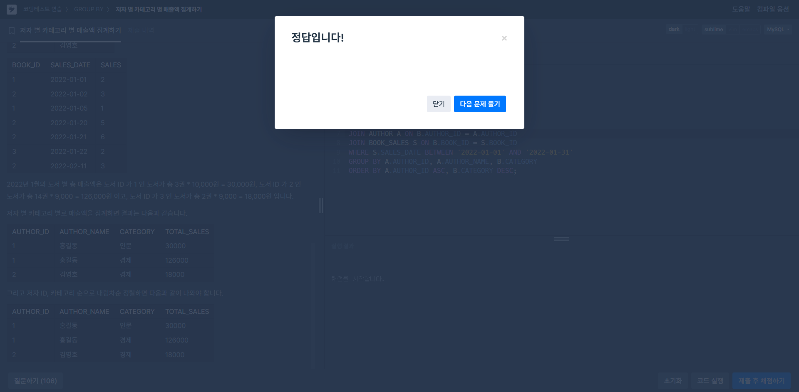
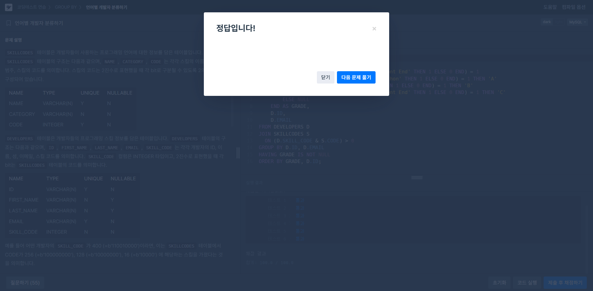

# SQL_Advanced Assignment 2주차

## 복합 JOIN & GROUP BY + HAVING

### 15.2.13.2 JOIN Clause
> 여러 개의 테이블을 결합하여 하나의 결과로 만드는 SQL 문법

---
#### 기본 JOIN 문법 구조
```SQL
SELECT 컬럼명
FROM 테이블1
  [INNER | LEFT | RIGHT | NATURAL | CROSS] JOIN 테이블2
  [ON 조인조건 | USING (공통컬럼명)];
```

---
#### 1️⃣ INNER JOIN
- 두 테이블 간 공통된 조건을 만족하는 행만 반환함
- `JOIN`, `CROSS JOIN`, `INNER JOIN`은 MySQL에서 동등함
```SQL
SELECT * FROM table1 INNER JOIN table2 ON table1.id = table2.id;
```

#### 2️⃣ LEFT [OUTER] JOIN
- 왼쪽 테이블의 모든 행을 반환하며, 오른쪽 테이블에서 매칭되지 않은 경우 NULL 처리됨
```SQL
SELECT left_tbl.*
FROM left_tbl LEFT JOIN right_tbl ON left_tbl.id = right_tbl.id
WHERE right_tbl.id IS NULL;
```
=> 오른쪽 테이블에 매칭되지 않는 행 찾기

#### 3️⃣ RIGHT [OUTER] JOIN
- 오른쪽 테이블의 모든 행을 반환하며, 왼쪽 테이블에서 매칭되지 않은 경우 NULL 처리됨
```SQL
SELECT left_tbl.*
FROM left_tbl LEFT JOIN right_tbl ON left_tbl.id = right_tbl.id
WHERE right_tbl.id IS NULL;
```

#### 4️⃣ NATURAL JOIN
- 두 테이블에서 같은 이름을 가진 모든 컬럼을 기준으로 자동 JOIN함
- 중복 컬럼은 결과에서 한 번만 나타남
```SQL
CREATE TABLE t1 (i INT, j INT);
CREATE TABLE t2 (k INT, j INT);
INSERT INTO t1 VALUES(1, 1);
INSERT INTO t2 VALUES(1, 1);

SELECT * FROM t1 NATURAL JOIN t2;

+------+------+------+
| j    | i    | k    |
+------+------+------+
|  1   |  1   |  1   |
+------+------+------+
```

#### 5️⃣ JOIN USING
- 명시된 컬럼을 기준으로 JOIN하며, 중복 컬럼은 한 번만 나타남
```SQL
SELECT * FROM t1 JOIN t2 USING (j);

+------+------+------+
| j    | i    | k    |
+------+------+------+
|  1   |  1   |  1   |
+------+------+------+
```

#### 6️⃣ STRAIGHT_JOIN
- 옵티마이저가 왼쪽 테이블을 먼저 읽도록 강제함
```SQL
SELECT * FROM table1 STRAIGHT_JOIN table2 ON 조건;
```

---
#### 서브쿼리 테이블
- 서브쿼리에는 별칭을 반드시 붙여야 함
```SQL
SELECT * FROM (SELECT 1, 2, 3) AS t1;
```

---
#### 괄호 사용 시 JOIN의 우선순위
- INNER JOIN만 존재하면 괄호를 써도 결과는 같음
- LEFT, RIGHT JOIN 등과 같이 외부 JOIN을 사용할 경우 괄호가 JOIN 범위를 결정함
```SQL
SELECT * FROM t1 LEFT JOIN (t2, t3, t4)
  ON (t2.a = t1.a AND t3.b = t1.b AND t4.c = t1.c);

-- 이는 다음과 동등함
SELECT * FROM t1 LEFT JOIN (t2 CROSS JOIN t3 CROSS JOIN t4)
  ON (t2.a = t1.a AND t3.b = t1.b AND t4.c = t1.c);
```

---
#### JOIN 시 주의 사항
- JOIN의 우선순위가 콤마(,)보다 높아, 콤마와 JOIN을 섞으면 해석에 혼동이 발생함
```SQL
-- 에러가 발생하는 예시
CREATE TABLE t1 (i1 INT, j1 INT);
CREATE TABLE t2 (i2 INT, j2 INT);
CREATE TABLE t3 (i3 INT, j3 INT);
INSERT INTO t1 VALUES(1, 1);
INSERT INTO t2 VALUES(1, 1);
INSERT INTO t3 VALUES(1, 1);

-- 다음 쿼리는 에러 발생 (Unknown column 't1.i1' in 'on clause')
SELECT * FROM t1, t2 JOIN t3 ON (t1.i1 = t3.i3);

-- 해결 방법 (괄호 사용)
SELECT * FROM (t1, t2) JOIN t3 ON (t1.i1 = t3.i3);

-- 또는 콤마 대신 JOIN으로 해결
SELECT * FROM t1 JOIN t2 JOIN t3 ON (t1.i1 = t3.i3);
```

---
#### USING과 ON의 컬럼 처리 차이
- USING은 두 테이블 공통 컬럼을 결합하여 한 번만 표시함
- ON은 양쪽 테이블 컬럼을 모두 표시함
```SQL
a LEFT JOIN b USING (c1, c2, c3)
-- 결과 컬럼: COALESCE(a.c1,b.c1), COALESCE(a.c2,b.c2), COALESCE(a.c3,b.c3)

a LEFT JOIN b ON a.c1 = b.c1 AND a.c2 = b.c2 AND a.c3 = b.c3
-- 결과 컬럼: a.c1, a.c2, a.c3, b.c1, b.c2, b.c3
```

---
- 최대 JOIN 가능한 테이블 수: 61개
- 인덱스 힌트를 사용하여 JOIN 성능 최적화 가능
```SQL
SELECT * FROM table1 USE INDEX (idx_col1) JOIN table2 ON 조건;
```
- ODBC 호환용 {OJ} 구문도 지원하나, 공식적 ODBC 표준은 아님
```SQL
SELECT left_tbl.*
FROM { OJ left_tbl LEFT OUTER JOIN right_tbl ON left_tbl.id = right_tbl.id }
WHERE right_tbl.id IS NULL;
```


### 14.19.3 MySQL Handling of GROUP BY
> 데이터를 특정 컬럼 기준으로 묶어 집계하는 데 사용됨

---
#### 표준 SQL과 MySQL의 차이

**SQL-92 표준**
- GROUP BY에 나열되지 않은 컬럼을 SELECT 리스트나 HAVING, ORDER BY 절에 넣으면 허용되지 않음
```SQL
SELECT o.custid, c.name, MAX(o.payment)
FROM orders AS o, customers AS c
WHERE o.custid = c.custid
GROUP BY o.custid;
```
- 여기서 `c.name`은 GROUP BY 절에 없고 집계함수도 아니므로, SQL-92에서는 위 쿼리는 허용되지 않음

**SQL 1999 이후**
- `GROUP BY 컬럼에 기능적으로 종속된 컬럼`이라면 SELECT에 포함할 수 있음
- 예를 들어, `custid`가 `customers` 테이블의 기본 키(primary key) 라면 위의 쿼리는 가능함
  - `custid`가 정해지면 `name` 값도 유일하게 결정되기 때문임

---
#### MySQL에서의 처리 방식 (ONLY_FULL_GROUP_BY 모드)

##### ONLY_FULL_GROUP_BY 활성화 (기본값)
- `GROUP BY에 없는 컬럼`이 SELECT, HAVING, ORDER BY에 사용될 때 MySQL은 두 가지 조건 중 하나를 충족해야 허용함

**조건 1: 기능적 종속성**
- GROUP BY에 나열된 컬럼에 종속된 컬럼이어야 함
  - 주로 GROUP BY 컬럼이 primary key거나 unique not null일 때 가능함
```SQL
SELECT name, address, MAX(age) FROM t GROUP BY name;
```
- 위 쿼리는 `name`이 primary key거나 unique not null일 때 허용됨
- 종속성이 없으면 다음과 같은 에러가 발생함
```SQL
ERROR 1055 (42000): Expression #2 of SELECT list is not in GROUP
BY clause and contains nonaggregated column 't.address'
```

**조건 2: 단일 값 제한 (WHERE 조건으로 하나의 값으로 제한 시 가능)**
- GROUP BY 절 없이 특정 값 하나로 컬럼 값을 제한한 경우 허용됨
```SQL
CREATE TABLE mytable (
  id INT PRIMARY KEY,
  a VARCHAR(10),
  b INT
);

INSERT INTO mytable VALUES 
(1, 'abc', 1000),
(2, 'abc', 2000);

-- a가 단일 값으로 제한된 경우 허용
SELECT a, SUM(b) FROM mytable WHERE a = 'abc';

-- 결과가 유일한 값으로 제한될 때 가능
+------+--------+
| a    | SUM(b) |
+------+--------+
| abc  |   3000 |
+------+--------+

-- 둘 이상의 컬럼에 대한 예시
SELECT a, b, SUM(c) FROM mytable
WHERE a = 'abc' AND b = 'qrs';
```
- 조건이 `AND`로 연결되어 모든 컬럼이 하나의 값으로 제한될 경우 허용됨

---
#### ONLY_FULL_GROUP_BY 비활성화 (MySQL 확장)
- ONLY_FULL_GROUP_BY가 비활성화된 경우, GROUP BY에 나열되지 않은 컬럼도 SELECT나 HAVING, ORDER BY 절에서 사용 가능함
- 이때는 MySQL이 각 그룹에서 임의의 값을 반환함
  - 정렬(ORDER BY) 로 어떤 값이 반환될지 영향을 줄 수 없음
  - 일반적으로 권장되지 않으며, 예측 가능한 결과가 필요한 경우 피해야 함
```SQL
SELECT name, address, MAX(age) FROM t GROUP BY name;
```
- GROUP 내에서 임의의 `address` 값을 반환함
- 대안으로 명확하게 임의의 값을 원하면 `ANY_VALUE()`를 사용함
```SQL
SELECT name, ANY_VALUE(address), MAX(age) FROM t GROUP BY name;
```

---
#### ANY_VALUE() 함수 (ONLY_FULL_GROUP_BY 활성화 시 권장)
- 비집계 컬럼 중 하나의 임의 값을 명시적으로 얻고 싶을 때 사용함
```SQL
-- 에러 발생 예시
SELECT name, MAX(age) FROM t;

-- ANY_VALUE로 해결
SELECT ANY_VALUE(name), MAX(age) FROM t;
```

---
#### GROUP BY의 별칭 및 표현식 허용 (MySQL 확장)
- MySQL은 별칭과 컬럼이 아닌 표현식을 GROUP BY 절에서 허용함
```SQL
-- 컬럼 표현식 GROUP BY (표준 SQL에서는 허용되지 않음)
SELECT id, FLOOR(value/100) FROM tbl_name GROUP BY id, FLOOR(value/100);

-- 별칭을 GROUP BY에서 허용 (MySQL 확장)
SELECT id, FLOOR(value/100) AS val FROM tbl_name GROUP BY id, val;
```
- MySQL은 비컬럼 표현식에 대해서는 기능적 종속성을 인식하지 않으므로, 추가적인 SELECT 표현식은 허용되지 않을 수 있음
```SQL
-- 다음 쿼리는 불가능 (세 번째 컬럼이 그룹의 표현식에 종속적이라도 불가능)
SELECT id, FLOOR(value/100), id+FLOOR(value/100)
FROM tbl_name GROUP BY id, FLOOR(value/100);

-- 해결책 (서브쿼리로 처리)
SELECT id, F, id+F
FROM (SELECT id, FLOOR(value/100) AS F
      FROM tbl_name GROUP BY id, FLOOR(value/100)) AS dt;
```

---
- `ONLY_FULL_GROUP_BY`는 명시적이고 예측 가능한 결과를 얻기 위해 활성화 권장
- 활성화된 경우, 그룹의 기능적 종속성 또는 명확한 값 제한(WHERE)을 반드시 충족해야 함
- 비활성화는 편리하지만, 예측할 수 없는 값이 반환될 수 있어 주의 필요
- 필요에 따라 `ANY_VALUE()`를 사용하여 비집계 컬럼을 선택 가능


### 15.2.13 SELECT Statement

#### HAVING 절의 정의 및 특징
> - `HAVING` 절은 그룹을 필터링할 때 사용함
> - 보통 `GROUP BY`와 함께 사용하여, 그룹화된 결과에 조건을 적용함
> - `HAVING`이 없으면 모든 그룹이 결과로 출력됨

---
#### HAVING과 WHERE의 차이점
| 구분                   | WHERE                         | HAVING                          |
|------------------------|-------------------------------|---------------------------------|
| 적용 대상              | 행(Row) 단위 조건             | 그룹(Group) 단위 조건           |
| 집계함수 사용 가능 여부 | ❌ 불가능                     | ✅ 가능                          |
| 실행 순서              | 그룹화(`GROUP BY`) 이전에 적용 | 그룹화(`GROUP BY`) 이후에 적용  |
- `WHERE`는 개별 행을 필터링하며, 집계함수(예: `MAX`, `COUNT`)를 사용할 수 없음
- `HAVING`은 이미 그룹화된 결과를 필터링하며, 집계함수를 사용할 수 있음

---
#### HAVING 절 사용 규칙 및 주의점

##### 표준 SQL 규칙
- 표준 SQL에서는 HAVING 절에서 반드시 다음 중 하나만 참조할 수 있음
  - `GROUP BY` 절에 포함된 컬럼
  - 집계 함수가 사용된 컬럼

##### MySQL의 확장된 규칙
- MySQL은 표준 SQL의 제약을 확장하여 다음을 허용함
  - HAVING에서 `SELECT 목록(select_expr)`에 있는 컬럼을 참조할 수 있음
  - HAVING에서 외부 서브쿼리의 컬럼 참조가 가능함

##### 모호성 주의
- HAVING 절에서 참조된 컬럼명이 중복(모호)되면 경고가 발생함
- 예를 들어, 컬럼 이름과 별칭이 중복된 경우 모호성이 생길 수 있음
```SQL
-- col2가 컬럼명과 별칭으로 동시에 사용됨 -> 경고 발생
SELECT COUNT(col1) AS col2 FROM t GROUP BY col2 HAVING col2 = 2;
```
- 이때는 표준 SQL 방식의 동작이 우선되어 `GROUP BY`의 컬럼이 선택됨

--- 
#### HAVING 대신 WHERE를 써야 하는 상황
- 집계함수를 사용하지 않고 단순히 행 단위 조건이라면 `HAVING` 대신 `WHERE`를 사용해야 함
```SQL
-- 잘못된 예시
SELECT col_name FROM tbl_name HAVING col_name > 0;
올바른 예시

-- 올바른 예시
SELECT col_name FROM tbl_name WHERE col_name > 0;
```

---
#### HAVING 절의 사용 예시
- 집계함수와 조건을 함께 사용할 때 대표적인 활용법임
```SQL
SELECT user, MAX(salary) FROM users
GROUP BY user HAVING MAX(salary) > 10;
```
=> 각 사용자의 최고 급여가 10보다 큰 경우의 그룹만 출력함

---
- HAVING 절은 그룹화 결과를 필터링할 때 필수적인 절임
- WHERE와 다르게 HAVING에서는 집계함수를 자유롭게 사용할 수 있음
- 표준 SQL보다 MySQL이 더 유연하게 HAVING 절을 확장하여 지원하고 있으나, 모호성 문제에 주의가 필요함
- 단순 조건식은 반드시 WHERE를 사용하는 것이 좋음


## 문제 풀이

### 문제 1 - 🔗 [programmers - 저자별 카테고리 별 매출액 집계하기](https://school.programmers.co.kr/learn/courses/30/lessons/144856)

```SQL
SELECT
    A.AUTHOR_ID,
    A.AUTHOR_NAME,
    B.CATEGORY,
    SUM(B.PRICE * S.SALES) AS SALES
FROM BOOK B
JOIN AUTHOR A ON B.AUTHOR_ID = A.AUTHOR_ID
JOIN BOOK_SALES S ON B.BOOK_ID = S.BOOK_ID
WHERE S.SALES_DATE BETWEEN '2022-01-01' AND '2022-01-31'
GROUP BY A.AUTHOR_ID, A.AUTHOR_NAME, B.CATEGORY
ORDER BY A.AUTHOR_ID ASC, B.CATEGORY DESC;
```

### 문제 2 - 🔗 [programmers - 언어별 개발자 분류하기](https://school.programmers.co.kr/learn/courses/30/lessons/276036) (도전)

```SQL
SELECT
    CASE
        WHEN MAX(CASE WHEN S.CATEGORY = 'Front End' THEN 1 ELSE 0 END) = 1
             AND MAX(CASE WHEN S.NAME = 'Python' THEN 1 ELSE 0 END) = 1 THEN 'A'
        WHEN MAX(CASE WHEN S.NAME = 'C#' THEN 1 ELSE 0 END) = 1 THEN 'B'
        WHEN MAX(CASE WHEN S.CATEGORY = 'Front End' THEN 1 ELSE 0 END) = 1 THEN 'C'
        ELSE NULL
    END AS GRADE,
    D.ID,
    D.EMAIL
FROM DEVELOPERS D
JOIN SKILLCODES S
  ON (D.SKILL_CODE & S.CODE) > 0
GROUP BY D.ID, D.EMAIL
HAVING GRADE IS NOT NULL
ORDER BY GRADE, D.ID;
```