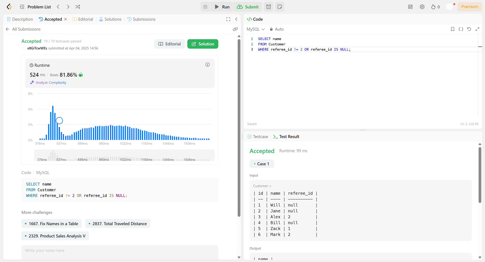
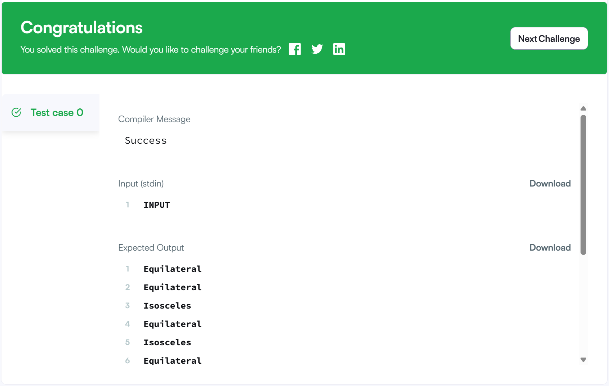

# SQL_Advanced Assignment 3주차

## CASE문 & 비교, 논리 연산자 활용

### 14.5 Flow Control Functions - 흐름제어함수

#### `CASE`

- 조건에 따라 다른 결과값을 반환하는 다중 조건 함수

```SQL
CASE value -- value 기준으로 비교
    WHEN compare_value1 THEN result1
    WHEN compare_value2 THEN result2
    ...
    [ELSE resultN]
END

SELECT CASE 1
    WHEN 1 THEN 'one'
    WHEN 2 THEN 'two'
    ELSE 'more'
END; -- 'one' 반환
```

```SQL
CASE -- condition 기준으로 비교
    WHEN condition1 THEN result1
    WHEN condition2 THEN result2
    ...
    [ELSE resultN]
END

SELECT CASE
    WHEN 1 > 0 THEN 'true'
    ELSE 'false'
END; -- 'true' 반환
```

---
**주의점**

-> 조건에 일치하는 것이 없고 `ELSE`가 없으면 기본으로 `NULL`을 반환함<br>
-> 저장 프로그램에서 사용하는 `CASE` 문은 문법이 약간 다름 (`END CASE`로 종료, `ELSE NULL` 불가)

---
**반환 타입 결정**

-> 반환값은 각 결과값들의 **통합된 자료형**을 따름<br>
-> 숫자형, 문자형, 날짜형 등 여러 타입이 섞이면 MySQL이 지정한 규칙에 따라 우선순위가 결정됨

#### `IF(expr1, expr2, expr3)`

- 조건에 따라 두 값 중 하나를 선택함
- `expr1` 조건식이 참이면 `expr2`를 반환, 거짓이면 `expr3`을 반환함

```SQL
IF(조건식, 참일 때 반환값, 거짓일 때 반환값)

SELECT IF(1<2, 'yes', 'no'); -- 'yes' 반환
```

---
**반환 타입 결정**

-> `expr2`, `expr3` 중 하나가 문자열이면 결과도 문자열<br>
-> 숫자/실수일 경우 그 타입 따름<br>
-> `NULL` 포함 시, 다른 표현식의 타입을 따름

#### `IFNULL(expr1, expr2)`

- `expr1`이 `NULL`이 아니면 그대로 반환, `NULL`이면 `expr2` 반환

```SQL
SELECT IFNULL(1, 0); -- 1
SELECT IFNULL(NULL, 10); -- 10
SELECT IFNULL(1/0, 10); -- 10
SELECT IFNULL(1/0, 'yes'); -- 'yes'
```

---
**반환 타입 결정**

-> STRING > REAL > INTEGER 순서로 일반적인 타입이 선택됨

#### `NULLIF(expr1, expr2)`

- 두 표현식이 같으면 `NULL`을 반환하고, 다르면 첫 번째 표현식을 반환함

```SQL
SELECT NULLIF(1, 1); -- NULL
SELECT NULLIF(1, 2); -- 1
```

---
**주의점**

-> `expr1`이 두 번 평가될 수 있음<br>
-> 문자셋 혼합 시 오류 발생 가능 → 명시적 캐스팅 필요

### 반환 데이터 타입 결정 규칙

**숫자형 비교:**
- 모두 정수형 → 더 큰 정수형 반환
- 정수형과 실수형 혼합 → 실수형 반환

**문자형 비교:**
- 최대 길이의 `VARCHAR`로 반환
- `ENUM`, `SET` → `VARCHAR`로 취급

**날짜형 비교:**
- 단일 타입(`DATE`, `TIME`, `TIMESTAMP`)일 경우 동일 타입 반환
- 혼합된 날짜형 → `DATETIME` 반환

**그 외:**
- `JSON` 타입만 → `JSON` 반환
- `BLOB` 포함 → `BLOB` 반환
- 혼합된 경우 기본적으로 `VARCHAR` 반환


### 14.4.2 Comparison Functions and Operators - 비교, 논리 연산자

#### 기본 비교 연산자

| 연산자      | 설명                         | 예시                   |
|-------------|------------------------------|------------------------|
| `=`         | 같음                         | `1 = 1 → 1 (TRUE)`     |
| `!=`, `<>`  | 같지 않음                    | `1 != 2 → 1 (TRUE)`    |
| `<=>`       | NULL-safe 같음 (NULL도 비교 가능) | `NULL <=> NULL → 1`   |
| `>`         | 초과                         | `2 > 1 → 1`            |
| `>=`        | 이상                         | `2 >= 2 → 1`           |
| `<`         | 미만                         | `1 < 2 → 1`            |
| `<=`        | 이하                         | `2 <= 2 → 1`           |

- 문자열과 숫자는 자동 형 변환되어 비교됨
- `(a, b) = (x, y)`처럼 row 비교도 가능함
    ```SQL
    (a, b) = (x, y) → (a = x) AND (b = y)
    (a, b) < (x, y) → (a < x) OR ((a = x) AND (b < y))
    ```

#### `BETWEEN AND` / `NOT BETWEEN AND`

- 값이 지정된 범위 내에 포함되는지 여부 확인

```SQL
expr BETWEEN min AND max
expr NOT BETWEEN min AND max

SELECT 5 BETWEEN 1 AND 10; -- 1(TRUE)
SELECT 5 NOT BETWEEN 1 AND 10; -- 0(FALSE)
```

#### `IN` / `NOT IN`

- 값이 목록에 있는지 여부 확인

```SQL
expr IN (value1, value2, ...)
expr NOT IN (value1, value2, ...)

SELECT 3 IN (1,2,3); -- 1(TRUE)
SELECT 'a' NOT IN ('b','c'); -- 1(TRUE)
```

#### `IS NULL` / `IS NOT NULL` / `ISNULL`

- `NULL` 여부 확인

```SQL
expr IS NULL
expr IS NOT NULL
ISNULL(expr)

SELECT NULL IS NULL; -- 1(TRUE)
SELECT 'abc' IS NOT NULL; -- 1(TRUE)
SELECT ISNULL(NULL); -- 1
```

#### `IS` / `IS NOT`

- Boolean 비교

```SQL
expr IS TRUE / FALSE / UNKNOWN
expr IS NOT TRUE / FALSE / UNKNOWN

SELECT 1 IS TRUE, 0 IS FALSE, NULL IS UNKNOWN; -- 1, 1, 1
SELECT 1 IS NOT UNKNOWN, 0 IS NOT UNKNOWN, NULL IS NOT UNKNOWN; -- 1, 1, 0
```

#### `LIKE` / `NOT LIKE`

- 문자열 패턴 비교

```SQL
expr LIKE pattern
expr NOT LIKE pattern

SELECT 'abc' LIKE 'a%'; -- 1(TRUE)
SELECT 'abc' NOT LIKE '%z'; -- 1(TRUE)
```

#### `EXISTS` / `NOT EXISTS`

- 서브쿼리의 결과 행 존재 여부 확인

```SQL
EXISTS(subquery)
NOT EXISTS(subquery)

SELECT EXISTS (SELECT * FROM table WHERE id=1);
```

#### `COALESCE`

- 첫 번째로 만나는 비 `NULL` 값 반환

```SQL
COALESCE(value1, value2, ...)

SELECT COALESCE(NULL, NULL, 'hello'); -- 'hello'
```

#### `LEAST` / `GREATEST`

- 여러 값 중 최소/최대값 반환

```SQL
LEAST(value1, value2, ...)
GREATEST(value1, value2, ...)

SELECT LEAST(1, 3, 5); -- 1
SELECT GREATEST(1, 3, 5); -- 5
```

#### `INTERVAL`

- 첫 번째 인수가 나머지 값들과 비교하여 위치 반환 (이진 탐색 방식)

```SQL
INTERVAL(N, N1, N2, N3, ...)

SELECT INTERVAL(15, 1, 10, 20); -- 2
```

---
**비교 연산 시 주의점**
- 숫자 <-> 문자열 비교 시 암묵적 타입 변환 발생
- 문자열 비교는 기본적으로 대소문자 구분 없음
- 날짜/시간 비교 시 CAST 사용 권장
- IN()에서 타입 혼합하지 말 것 (숫자와 문자열 혼합 주의)


## 문제 풀이

### 문제 1 - 🔗 [HackerRank - 삼각형 종류 분류하기](https://www.hackerrank.com/challenges/what-type-of-triangle/problem) `CASE문`

```SQL
SELECT 
    CASE
        WHEN A + B <= C OR A + C <= B OR B + C <= A THEN 'Not A Triangle'
        WHEN A = B AND B = C THEN 'Equilateral'
        WHEN A = B OR B = C OR A = C THEN 'Isosceles'
        ELSE 'Scalene'
    END AS triangle_type
FROM TRIANGLES;
```

### 문제 2 - 🔗 [LeetCode - find-customer-referee](https://leetcode.com/problems/find-customer-referee/description/) `IS NULL`

```SQL
SELECT name
FROM Customer
WHERE referee_id != 2 OR referee_id IS NULL;
```