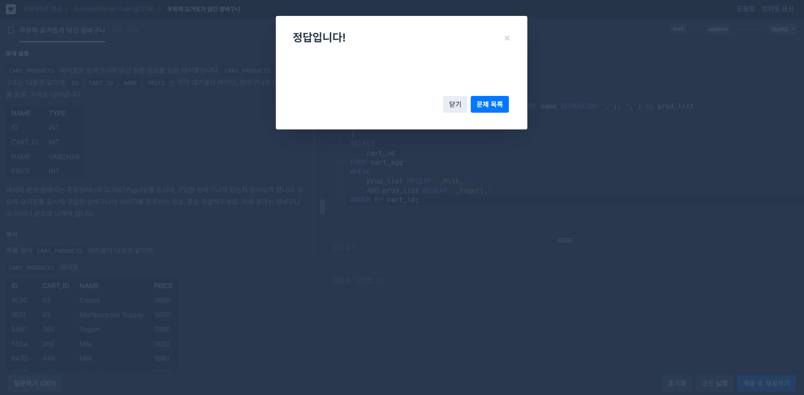
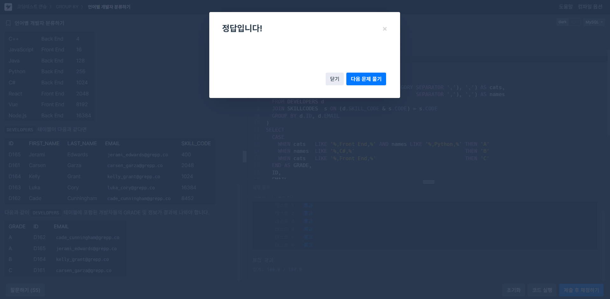
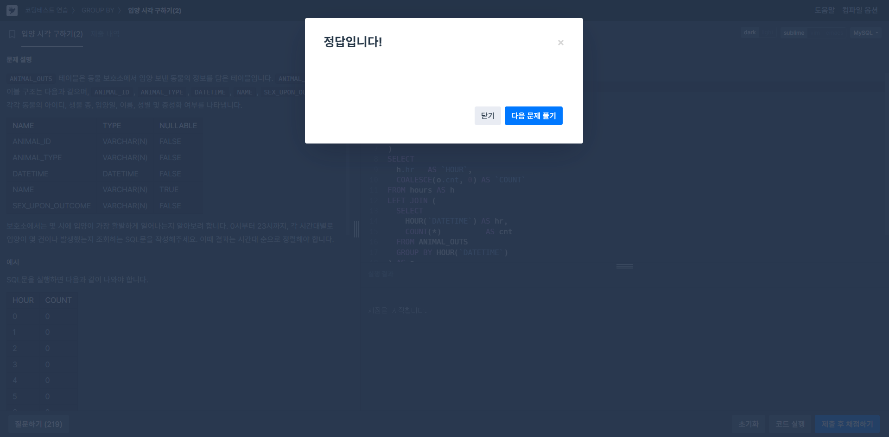

# SQL_Advanced Assignment 4주차

## GROUP_CONCAT() & CTE  

### 14.19.1 Aggregate Function Descriptions

#### `GROUP_CONCAT()`
- 그룹별로 여러 행의 **非-NULL** 값을 하나의 문자열로 합쳐 반환하는 집계 합수
- NULL 값은 기본적으로 무시(그룹 내 값이 모두 NULL이면 결과도 NULL)

```sql
GROUP_CONCAT(
    [DISTINCT] expr [, expr …]
    [ORDER BY expr [ASC|DESC] [, …]]
    [SEPARATOR '구분자']
)
```
- **DISTINCT:** 중복된 `expr` 값을 한 번만 포함
- **ORDER BY:** 결합 전에 그룹 내 값을 지정한 순서(ASC/DESC)로 정렬
- **SEPERATOR:** ‘, ’ 대신 사용할 문자열 지정 (예: `SEPARATOR '; '`)

---
#### 반환 타입 및 길이 제한
- 반환형은 **TEXT** 또는 **BLOB** (입력 문자열의 바이너리 여부에 따라)
- 최대 길이는 시스템 변수 `group_concat_max_len`(기본 1024)로 제어

```sql
-- 세션 단위로 제한 늘리기 예시
SET SESSION group_concat_max_len = 5000;
```
- `max_allowed_packet`도 최종 가능한 최대 길이를 제한

---
#### 동작 특징
- **NULL 무시:** NULL은 결합 대상에서 빠짐
- **빈 그룹 처리:** 그룹에 값이 하나도 없으면 NULL 반환
- **자료형 변환:** SET·ENUM 타입은 내부 숫자 값으로 캐스팅 후 처리

---
#### 사용 예시

**기본 사용**
```sql
SELECT student_name,
       GROUP_CONCAT(test_score)
  FROM student
 GROUP BY student_name;
```
- **GROUP BY student_name**<br>
=> `student` 테이블을 학생 이름(`student_name`)별로 묶음

- **GROUP_CONCAT(test_score)**<br>
=> 각 학생 그룹에서 `test_score` 값을 **콤마(“,”)**로 이어 붙인 하나의 문자열로 반환함<br>
=> 예를 들어, Alice 학생의 점수가 `80, 90, 85` 세 개라면, 결과 컬럼엔 `"80,90,85"`로 나타남

- **NULL 무시**
- `test_score`가 `NULL`인 행은 아예 결합 대상에서 빠짐

<br>

**중복 제거 + 내림차순 정렬 + 구분자 변경**
```sql
SELECT student_name,
       GROUP_CONCAT(
         DISTINCT test_score
         ORDER BY test_score DESC
         SEPARATOR ' '
       ) AS scores
  FROM student
 GROUP BY student_name;
```
- **DISTINCT test_score**<br>
=> 같은 점수가 여러 번 있어도 한 번만 포함

- **ORDER BY test_score DESC**<br>
=> 결합 전에 점수를 **내림차순**으로 정렬함

- **SEPARATOR ' '**<br>
=> 기본 쉼표(“,”) 대신 **공백 한 칸**(`' '`)을 구분자로 사용함

- **결과 예시**<br>
=> 원점수 `[70, 90, 90, 85]` → 중복 제거 후 `[90, 85, 70]` → `"90 85 70"`

<br>

**NULL을 대체하여 포함**
```sql
SELECT team,
       GROUP_CONCAT(
         COALESCE(project, 'Unassigned')
         ORDER BY project
         SEPARATOR '|'
       ) AS project_list
  FROM projects
 GROUP BY team;
```
- **COALESCE(project, 'Unassigned')**<br>
=> `project` 컬럼이 `NULL` 이면 대신 `'Unassigned'` 문자열을 사용함

- **ORDER BY project**<br>
=> (NULL을 `'Unassigned'` 로 바꾼 뒤) 사전순 **오름차순** 정렬

- **SEPARATOR '|'**<br>
=> 파이프(`|`) 기호로 각 값을 구분

- **의의**<br>
=> NULL 값을 그냥 빼버리지 않고, “할당되지 않음” 표시를 포함시켜 **누락 없이** 문자열로 결합할 때 유용함


### 15.2.20 WITH (Common Table Expressions)

#### `WITH RECURSIVE`
- **재귀 CTE**를 정의하여, 하나의 쿼리 안에서 자기 자신을 참조하며 반복적으로 결과를 확장할 때 사용
- 연속 수열, 날짜 범위 생성, 트리·계층형 데이터 순회 등에 활용

```sql
WITH RECURSIVE cte_name [(col1, col2, …)] AS (
  -- 1) 비재귀(초기 seed) 부분
  SELECT …  
  UNION ALL   -- 또는 UNION DISTINCT
  -- 2) 재귀(반복) 부분: FROM cte_name 참조
  SELECT … FROM cte_name WHERE …  
)
SELECT * FROM cte_name;
```
- `WITH RECURSIVE` 키워드: CTE 중 하나라도 자기 자신을 참조하면 반드시 사용

- **UNION ALL** vs **UNION DISTINCT**:
  - `ALL` — 중복 허용
  - `DISTINCT` — 중복 제거

---
#### 작동 원리
- **비재귀 부분:** 초기 행(들)을 생성, CTE 이름 미참조
- **재귀 부분:**
  - `FROM cte_name`으로 이전 결과를 읽고 새 행 생성
  - **종료 조건**(`WHERE`)이 만족되지 않으면 반복 종료
- **컬럼 이름·타입:**
  - `(col1, col2, …)`로 직접 지정하거나,
  - 비재귀 첫 번째 `SELECT`의 출력 컬럼명·타입을 따라감

---
#### 주요 제약
- **반드시 종료 조건** 포함 (예: `WHERE n < 100`)
- 재귀 부분에 **사용 불가**:
  - 집계 함수 (`SUM()`, `AVG()` 등)
  - 윈도우 함수
  - `GROUP BY` / `ORDER BY` / `DISTINCT` (단, `UNION DISTINCT` 허용)
- 재귀 부분에서 CTE는 **한 번만** `FROM`에 참조
- **왼쪽 조인** 시 CTE는 오른쪽에 올 수 없음

---
#### 안전장치

- **깊이 제한:**
  - 시스템 변수 `cte_max_recursion_depth` (기본 1000)
  - 세션 혹은 글로벌로 조정 가능
- **시간 제한:**
  - 세션 변수 `max_execution_time`
  - 쿼리 힌트 `/*+ MAX_EXECUTION_TIME(ms) */`
- **행 수 제한:**
  - MySQL 8.0.19+ 에서 재귀 부분 내 `LIMIT n` 사용 가능

---
#### 대표 예제

**단순 숫자 시퀀스**

```sql
WITH RECURSIVE seq(n) AS (
  SELECT 1
  UNION ALL
  SELECT n+1 FROM seq WHERE n < 5
)
SELECT * FROM seq;
-- 결과: 1,2,3,4,5
```

<br>

**날짜 범위 생성**

```sql
WITH RECURSIVE dates(d) AS (
  SELECT MIN(order_date) FROM orders
  UNION ALL
  SELECT d + INTERVAL 1 DAY
    FROM dates
   WHERE d + INTERVAL 1 DAY <= (SELECT MAX(order_date) FROM orders)
)
SELECT d FROM dates;
```

<br>

**계층형 조직도 순회**

```sql
WITH RECURSIVE org(id, path) AS (
  SELECT id, CAST(id AS CHAR(200)) FROM employees WHERE manager_id IS NULL
  UNION ALL
  SELECT e.id, CONCAT(o.path, '>', e.id)
    FROM org AS o JOIN employees AS e
      ON e.manager_id = o.id
)
SELECT * FROM org;
```


## 문제 풀이

### 문제 1 - 🔗 [programmers - 우유와 요거트가 담긴 장바구니](https://school.programmers.co.kr/learn/courses/30/lessons/62284) **`GROUP_CONCAT()`**

```sql
WITH cart_agg AS (
    SELECT
        cart_id,
        CONCAT(',', GROUP_CONCAT(name ORDER BY name SEPARATOR ','), ',') AS prod_list
    FROM cart_products
    GROUP BY cart_id
)
SELECT
    cart_id
FROM cart_agg
WHERE
    prod_list REGEXP ',Milk,'
    AND prod_list REGEXP ',Yogurt,'
ORDER BY cart_id;
```

### 문제 2 - 🔗 [programmers - 언어별 개발자 분류하기](https://school.programmers.co.kr/learn/courses/30/lessons/276036)

```sql
WITH dev_agg AS (
  SELECT
    d.ID,
    d.EMAIL,
    CONCAT(',', GROUP_CONCAT(DISTINCT s.CATEGORY SEPARATOR ','), ',') AS cats,
    CONCAT(',', GROUP_CONCAT(DISTINCT s.NAME SEPARATOR ','), ',') AS names
  FROM DEVELOPERS d
  JOIN SKILLCODES s ON (d.SKILL_CODE & s.CODE) = s.CODE
  GROUP BY d.ID, d.EMAIL
)
SELECT
  CASE
    WHEN cats LIKE '%,Front End,%' AND names LIKE '%,Python,%' THEN 'A'
    WHEN names LIKE '%,C#,%' THEN 'B'
    WHEN cats LIKE '%,Front End,%' THEN 'C'
  END AS GRADE,
  ID,
  EMAIL
FROM dev_agg
WHERE
  CASE
    WHEN cats LIKE '%,Front End,%' AND names LIKE '%,Python,%' THEN 'A'
    WHEN names LIKE '%,C#,%' THEN 'B'
    WHEN cats LIKE '%,Front End,%' THEN 'C'
  END IS NOT NULL
ORDER BY GRADE, ID;
```

### 문제 3 - 🔗 [programmers - 입양 시각 구하기(2)](https://school.programmers.co.kr/learn/courses/30/lessons/59413) **`WITH RECURSIVE`**

```sql
WITH RECURSIVE hours AS (
  SELECT 0 AS hr
  UNION ALL
  SELECT hr + 1
    FROM hours
   WHERE hr < 23
)
SELECT
  h.hr AS `HOUR`,
  COALESCE(o.cnt, 0) AS `COUNT`
FROM hours AS h
LEFT JOIN (
  SELECT
    HOUR(`DATETIME`) AS hr,
    COUNT(*) AS cnt
  FROM ANIMAL_OUTS
  GROUP BY HOUR(`DATETIME`)
) AS o
  ON h.hr = o.hr
ORDER BY h.hr;
```