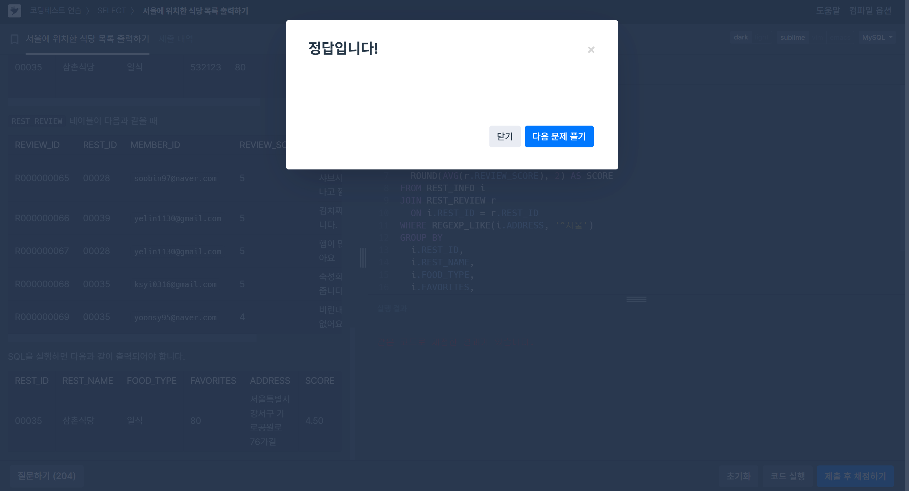
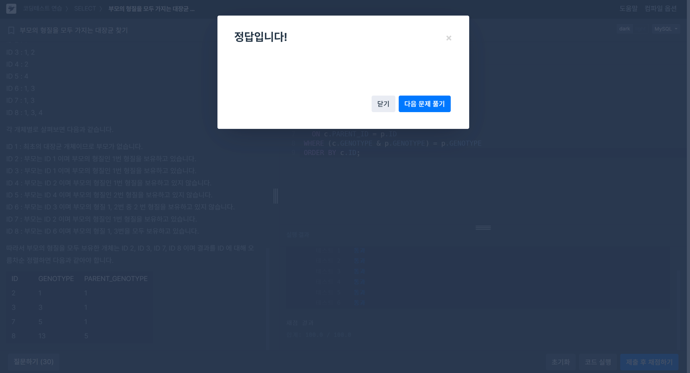

# SQL_Advanced Assignment 5주차

## 정규 표현식(REGEXP) & 비트 연산자

### 14.8.2 Regular Expressions

> **정규표현식(Regular Expression)**: 복잡한 패턴을 정의하여 문자열을 검색하거나 조작하는 강력한 도구

---
#### 주요 연산자 및 함수

| 함수/연산자        | 설명                                         |
|-------------------|----------------------------------------------|
| `REGEXP`, `RLIKE` | 문자열이 패턴과 일치하면 `1`, 아니면 `0` 반환 |
| `NOT REGEXP`      | `REGEXP` 부정                                 |
| `REGEXP_INSTR()`  | 일치하는 부분의 **시작 인덱스** 반환          |
| `REGEXP_LIKE()`   | `REGEXP`와 동일 기능 (권장)                   |
| `REGEXP_REPLACE()`| 일치 부분을 새 문자열로 **치환**               |
| `REGEXP_SUBSTR()` | 일치 부분을 **추출**                          |

---
#### 주요 함수 설명

**REGEXP / RLIKE**
- 문자열이 정규표현식과 일치하면 `1`, 아니면 `0` 반환.<br>
`REGEXP_LIKE()`와 동일 기능.

```sql
SELECT 'abc' REGEXP '^[a-z]+$'; -- 결과: 1
```

**REGEXP_INSTR()**
- 일치하는 부분의 시작 위치 반환 (1부터 시작).

**옵션:**
- `pos`: 검색 시작 위치
- `occurrence`: 몇 번째 일치를 찾을지
- `return_option`: 첫 글자(0) 또는 끝나는 위치(1)

```sql
SELECT REGEXP_INSTR('dog cat dog', 'dog'); -- 결과: 1
SELECT REGEXP_INSTR('dog cat dog', 'dog', 2); -- 결과: 9
```

**REGEXP_LIKE()**
- 문자열이 정규표현식에 일치하는지 확인.

**옵션(`match_type`):**
- `c`: 대소문자 구분
- `i`: 대소문자 무시
- `m`: 다중 라인 모드
- `n`: `.`이 줄바꿈도 포함하도록
- `u`: 유닉스 전용 줄바꿈

```sql
SELECT REGEXP_LIKE('CamelCase', 'CAMELCASE'); -- 결과: 1
SELECT REGEXP_LIKE('CamelCase', 'CAMELCASE', 'c'); -- 결과: 0
SELECT REGEXP_LIKE('abc\ndef', '^def$', 'm'); -- 결과: 1
```

**REGEXP_REPLACE()**
- 일치하는 부분을 새 문자열로 치환.

**옵션:**
- `pos`: 검색 시작 위치 (기본값: 1)
- `occurrence`: 몇 번째 일치를 치환할지 (기본값: 0 → 전부 치환)
- `match_type`: 대소문자 구분 등 매칭 옵션 (`c`, `i`, `m` 등)

```sql
SELECT REGEXP_REPLACE('a b c', 'b', 'X'); -- 결과: 'a X c'
SELECT REGEXP_REPLACE('abc def ghi', '[a-z]+', 'X', 1, 3); -- 결과: 'abc def X'
```

**REGEXP_SUBSTR()**
- 일치하는 부분 문자열 반환.

**옵션:**
- `pos`: 검색 시작 위치 (기본값: 1)
- `occurrence`: 몇 번째 일치를 치환할지 (기본값: 0 → 전부 치환)
- `match_type`: 대소문자 구분 등 매칭 옵션 (`c`, `i`, `m` 등)

```sql
SELECT REGEXP_SUBSTR('abc def ghi', '[a-z]+'); -- 결과: 'abc'
SELECT REGEXP_SUBSTR('abc def ghi', '[a-z]+', 1, 3); -- 결과: 'ghi'
```

---
#### 주요 메타문자

| 패턴     | 의미                                         |
|---------|----------------------------------------------|
| `^`     | 문자열 시작                                  |
| `$`     | 문자열 끝                                    |
| `.`     | 임의의 문자 (`m` 옵션 없이는 줄바꿈 제외)     |
| `*`     | 0회 이상 반복                                |
| `+`     | 1회 이상 반복                                |
| `?`     | 0 또는 1회                                   |
| `|`     | OR (alternation)                             |
| `(…)`   | 그룹화                                       |
| `{n}`, `{m,n}` | 반복 횟수 지정                         |
| `[abc]` | 문자 클래스 (예: `[a-dX]` / `[^a-dX]`)       |
| `[[:digit:]]` | POSIX 클래스 (alnum, alpha, digit 등)  |

> ※ 특수문자(예: `(`, `[`, `+` 등)를 문자 그대로 쓰고 싶으면 두 번 백슬래시(`\\`) 필요.


### 14.12 Bit Functions and Operators

#### 비트 연산자란?
- 컴퓨터는 모든 데이터를 **0과 1**로 표현함
- 비트 연산자는 이 0·1 단위(비트)를 직접 조작하는 연산

---
#### 주요 비트 연산자

| 연산자 | 이름          | 설명                                                       | 예시 (10진수 → 2진수)                          |
|--------|--------------|-----------------------------------------------------------|-----------------------------------------------|
| `&`    | 비트 AND     | 두 비트가 모두 1일 때만 1                                   | `5 & 3` → `101 & 011 = 001` → `1`             |
| `\|`   | 비트 OR      | 두 비트 중 하나라도 1이면 1                                | `5 \| 3` → `101 \| 011 = 111` → `7`           |
| `^`    | 비트 XOR     | 두 비트가 다를 때만 1                                      | `5 ^ 3` → `101 ^ 011 = 110` → `6`             |
| `~`    | 비트 NOT     | 모든 비트를 뒤집음 (0↔1)                                   | `~5` → `~000…0101 = 111…1010` (64비트 정수 기준 매우 큰 수) |
| `<<`   | 왼쪽 시프트   | 비트를 왼쪽으로 n만큼 밀고, 빈자리 오른쪽에 0을 채움 (×2 효과) | `1 << 2` → `0001 << 2 = 0100` → `4`           |
| `>>`   | 오른쪽 시프트 | 비트를 오른쪽으로 n만큼 밀고, 빈자리 왼쪽에 0을 채움 (÷2 효과) | `4 >> 1` → `0100 >> 1 = 0010` → `2`           |

```sql
SELECT 5 & 3; -- 결과: 1
SELECT 5 | 3; -- 결과: 7
SELECT 5 ^ 3; -- 결과: 6

SELECT 1 << 2; -- 결과: 4
SELECT 4 >> 1; -- 결과: 2
```

---
#### 숫자 vs 이진 문자열 평가

**1. 숫자 평가(Numeric)**
- 기본적으로 정수(BIGINT)로 간주하고 64비트 범위 내에서 연산
- 예) `29 | 15` → 31

**2. 이진 문자열 평가(Binary-string)**
- BINARY/VARBINARY/BLOB 타입 또는 `_binary` 키워드가 섞여 있으면
- **문자열 길이만큼** 이진 데이터를 연산
- 예) `_binary X'40404040' | X'01020304'` → `'ABCD'`

---
#### 비트 함수

**`BIT_COUNT(N)`**<br>
=> N에서 1로 설정된 비트 개수 반환

```sql
-- 예시: 15 (0b1111) 에서 1비트 개수
SELECT BIT_COUNT(15);  -- 결과: 4
```

- 추가로, 그룹 단위로 사용할 수 있는 `BIT_AND()`, `BIT_OR()`, `BIT_XOR()` 집계함수가 있음

---
#### 언제 활용하나요?

- **플래그(flag) 관리**: 여러 옵션을 비트 마스크로 저장
- **마스크(mask)**: 특정 비트만 골라내거나(`&`), 끌 때(`~`)
- **고속 곱셈·나눗셈**: `<<`, `>>` 로 2의 제곱 연산


## 문제 풀이

### 문제 1 - 🔗 [programmers - 서울에 위치한 식당 목록 출력하기](https://school.programmers.co.kr/learn/courses/30/lessons/131118)

```sql
SELECT
  i.REST_ID,
  i.REST_NAME,
  i.FOOD_TYPE,
  i.FAVORITES,
  i.ADDRESS,
  ROUND(AVG(r.REVIEW_SCORE), 2) AS SCORE
FROM REST_INFO i
JOIN REST_REVIEW r
  ON i.REST_ID = r.REST_ID
WHERE REGEXP_LIKE(i.ADDRESS, '^서울')
GROUP BY
  i.REST_ID,
  i.REST_NAME,
  i.FOOD_TYPE,
  i.FAVORITES,
  i.ADDRESS
ORDER BY
  SCORE DESC,
  i.FAVORITES DESC;
```

### 문제 2 - 🔗 [programmers - 부모의 형질을 모두 가지는 대장균 찾기](https://school.programmers.co.kr/learn/courses/30/lessons/301647)

```sql
SELECT
  c.ID,
  c.GENOTYPE,
  p.GENOTYPE AS PARENT_GENOTYPE
FROM ECOLI_DATA c
JOIN ECOLI_DATA p
  ON c.PARENT_ID = p.ID
WHERE (c.GENOTYPE & p.GENOTYPE) = p.GENOTYPE
ORDER BY c.ID;
```