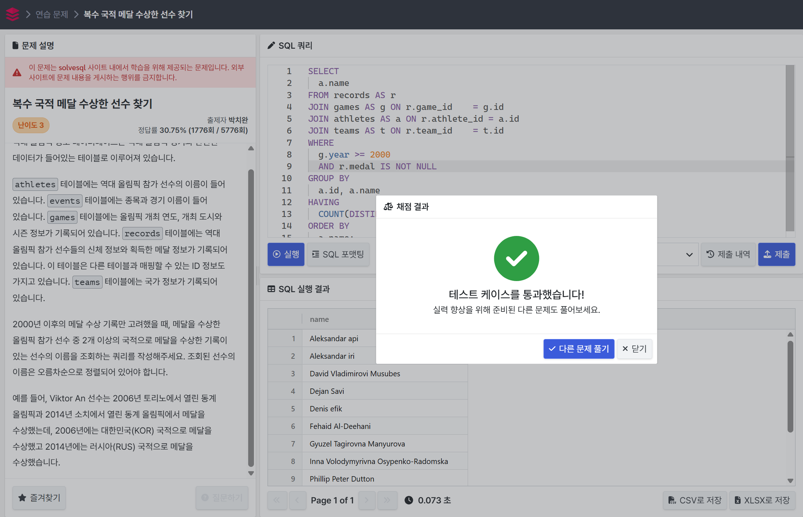
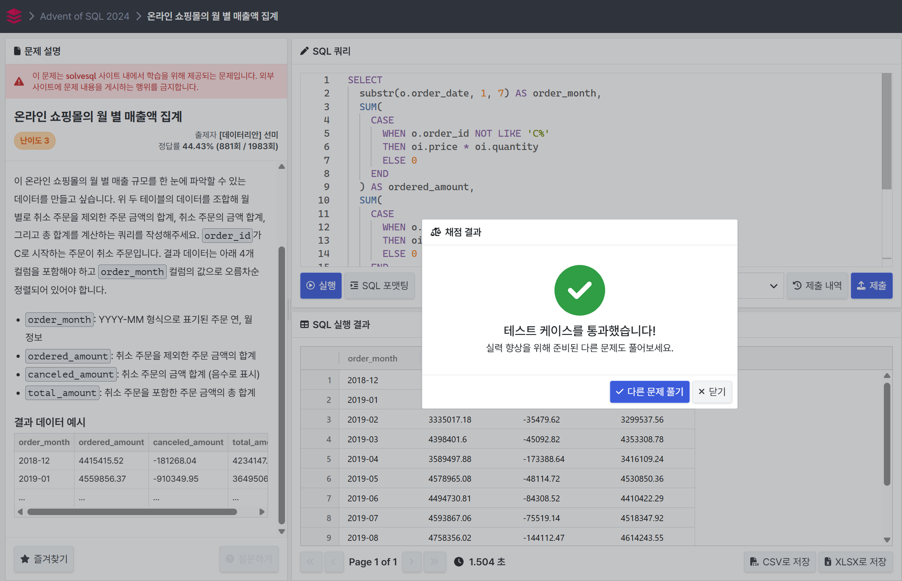
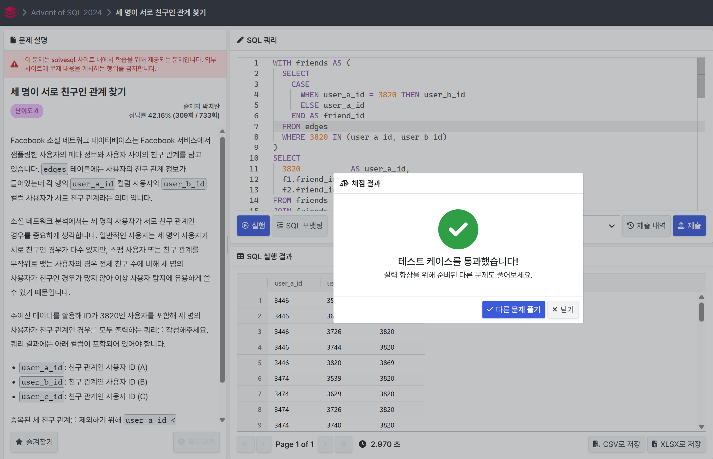

# SQL_Advanced Assignment 6주차

## 종합 실전 문제 풀이

### 문제 1 - 🔗 [solvesql - 복수 국적 메달 수상한 선수 찾기](https://solvesql.com/problems/multiple-medalist/)

**쿼리를 작성하는 목표, 확인할 지표**
- 2000년 이후 올림픽에서 메달(금·은·동)을 획득한 선수 중,  
  서로 다른 국적(팀 코드)으로 최소 2회 이상 메달을 수상한 선수 조회

**쿼리 계산 방법**
1. `records` 테이블에서 메달이 있는 (`medal IS NOT NULL`) 레코드만 선택  
2. `games` 테이블의 연도가 2000년 이상 (`year >= 2000`)인 것만 필터  
3. 선수별로 (`athlete_id`) **서로 다른** `teams.noc` 개수를 집계  
4. 그 개수가 2개 이상인 선수만 추려서 이름 출력

**데이터의 기간**
- 2000년 이후 개최된 모든 올림픽 (`games.year >= 2000`)

**사용할 테이블**
- `records`: 선수별 메달·팀 정보  
- `games`: 올림픽 연도 및 개최 정보  
- `athletes`: 선수 이름  
- `teams`: 팀/국적 코드

**Join KEY**
- `records.game_id = games.id`  
- `records.athlete_id = athletes.id`  
- `records.team_id = teams.id`

**데이터 특징**
- `records.medal` 이 **NULL이 아니면** 메달 수상 기록  
- `teams.noc` 에 국가 코드(e.g. `KOR`, `RUS`) 저장  
- 동일 선수가 여러 대회, 여러 팀 코드로 메달을 딸 수 있음



```sql
SELECT
  a.name
FROM records AS r
JOIN games AS g ON r.game_id    = g.id
JOIN athletes AS a ON r.athlete_id = a.id
JOIN teams AS t ON r.team_id    = t.id
WHERE
  g.year >= 2000
  AND r.medal IS NOT NULL
GROUP BY
  a.id, a.name
HAVING
  COUNT(DISTINCT t.team) >= 2
ORDER BY
  a.name;
```


---
### 문제 2 - 🔗 [solvesql - 온라인 쇼핑몰의 월 별 매출액 집계](https://solvesql.com/problems/shoppingmall-monthly-summary/)

**쿼리를 작성하는 목표, 확인할 지표**
- 월별 매출 규모를 한눈에 파악하기 위해,  
  1) 취소되지 않은 주문 금액의 합계  
  2) 취소 주문 금액의 합계(음수 표시)  
  3) 총 매출 합계(취소 포함)  
  을 계산

**쿼리 계산 방법**
1. `orders`와 `order_items` 테이블을 `order_id`로 조인  
2. `order_date`에서 연-월(YYYY-MM) 형식으로 추출 → `order_month`  
3. 월별로  
   - **ordered_amount**: `order_id`가 `'C%'` (취소) 가 아닌 주문의 `(quantity * unit_price)` 합  
   - **canceled_amount**: `order_id`가 `'C%'` 인 주문의 `(quantity * unit_price)` 합에 `-1`을 곱해 음수로 표시  
   - **total_amount**: 위 두 값을 더한 합계

**데이터의 기간**
- 전체 주문 데이터 (특정 기간 제한 없음)

**사용할 테이블**
- `orders`: 주문 기본 정보(`order_id`, `order_date` 등)  
- `order_items`: 주문 상세 정보(`order_id`, `unit_price`, `quantity` 등)

**Join KEY**
- `orders.order_id = order_items.order_id`

**데이터 특징**
- `order_id`가 `'C'`로 시작하면 해당 주문은 **취소 주문**  
- `order_items`에 `unit_price`와 `quantity`로 금액 계산 가능  
- `order_date` 컬럼에 주문 일자(YYYY-MM-DD 등) 저장



```sql
SELECT
  substr(o.order_date, 1, 7) AS order_month,
  SUM(
    CASE 
      WHEN o.order_id NOT LIKE 'C%' 
      THEN oi.price * oi.quantity 
      ELSE 0 
    END
  ) AS ordered_amount,
  SUM(
    CASE
      WHEN o.order_id LIKE 'C%' 
      THEN oi.price * oi.quantity 
      ELSE 0 
    END
  ) AS canceled_amount,
  SUM(oi.price * oi.quantity) AS total_amount
FROM orders o
JOIN order_items oi
  ON o.order_id = oi.order_id
GROUP BY
  order_month
ORDER BY
  order_month;
```


---
### 문제 3 - 🔗 [solvesql - 세 명이 서로 친구인 관계 찾기](https://solvesql.com/problems/friend-group-of-3/)

**쿼리를 작성하는 목표, 확인할 지표**
- ID가 `3820`인 사용자를 포함하고, 세 명이 모두 서로 친구 관계(`triangle`)인 경우의 사용자 ID 3인조를 출력
- `(A, B, C)` 쌍이 `user_a_id < user_b_id < user_c_id`를 만족하며, 세 쌍 `(A–B, A–C, B–C)` 모두 `edges` 테이블에 존재하는지 여부

**쿼리 계산 방법**
1. `edges` 테이블에서 **3820**과 친구인 사용자 목록(`friends`)을 추출  
2. 이 친구 목록에서 두 명을 **페어**로 뽑아(`f1 < f2`)  
3. 이 두 사용자 `f1`, `f2` 사이에도 친구 관계가 있는지 확인  
4. 세 사용자 `(3820, f1, f2)`의 **정렬된 순서**에 따라 세 가지 경우로 나누어 `A<B<C` 형태로 출력  
5. 위 세 경우를 `UNION ALL`로 합친 후 중복 제거 및 정렬

**데이터의 기간**
- 전체 기간 (시간 조건 없음)

**사용할 테이블**
- `edges`  
  - `user_a_id`, `user_b_id`: 친구 관계 (양방향)

**Join KEY**
- 친구 관계 확인:  
  `(user_a_id = x AND user_b_id = y) OR (user_a_id = y AND user_b_id = x)`

**데이터 특징**
- `edges` 한 행당 한 쌍의 친구 관계를 저장  
- 친구 관계는 **양방향**이므로 `(A,B)` 또는 `(B,A)` 중 하나만 저장돼 있을 수 있음  
- `3820`과 친구인 사용자만 고려  



```sql
WITH friends AS (
  SELECT
    CASE
      WHEN user_a_id = 3820 THEN user_b_id
      ELSE user_a_id
    END AS friend_id
  FROM edges
  WHERE 3820 IN (user_a_id, user_b_id)
)
SELECT
  3820           AS user_a_id,
  f1.friend_id   AS user_b_id,
  f2.friend_id   AS user_c_id
FROM friends f1
JOIN friends f2
  ON f1.friend_id < f2.friend_id
JOIN edges e
  ON (e.user_a_id = f1.friend_id AND e.user_b_id = f2.friend_id)
   OR (e.user_a_id = f2.friend_id AND e.user_b_id = f1.friend_id)
WHERE
  3820 < f1.friend_id
  AND 3820 < f2.friend_id
UNION ALL
SELECT
  f1.friend_id  AS user_a_id,
  3820          AS user_b_id,
  f2.friend_id  AS user_c_id
FROM friends f1
JOIN friends f2
  ON f1.friend_id < f2.friend_id
JOIN edges e
  ON (e.user_a_id = f1.friend_id AND e.user_b_id = f2.friend_id)
   OR (e.user_a_id = f2.friend_id AND e.user_b_id = f1.friend_id)
WHERE
  f1.friend_id < 3820
  AND 3820 < f2.friend_id
UNION ALL
SELECT
  f1.friend_id  AS user_a_id,
  f2.friend_id  AS user_b_id,
  3820          AS user_c_id
FROM friends f1
JOIN friends f2
  ON f1.friend_id < f2.friend_id
JOIN edges e
  ON (e.user_a_id = f1.friend_id AND e.user_b_id = f2.friend_id)
   OR (e.user_a_id = f2.friend_id AND e.user_b_id = f1.friend_id)
WHERE
  f1.friend_id < f2.friend_id
  AND f2.friend_id < 3820
ORDER BY
  user_a_id,
  user_b_id,
  user_c_id;
```