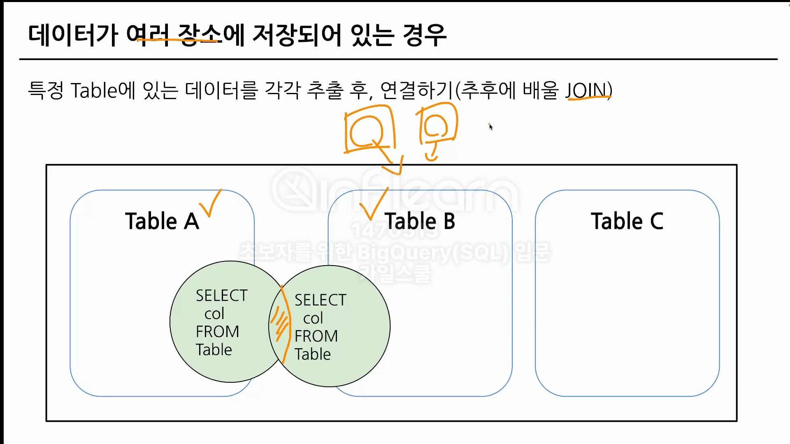
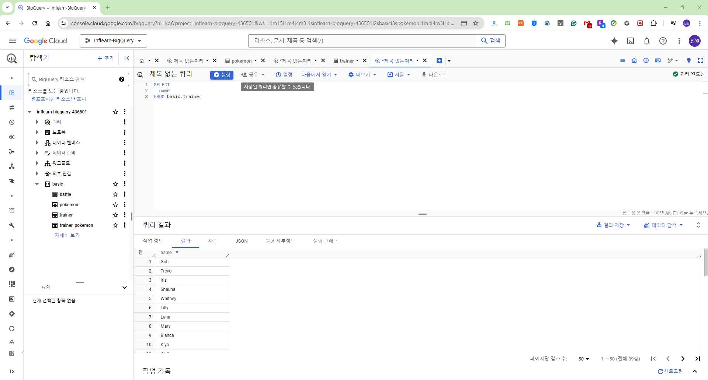
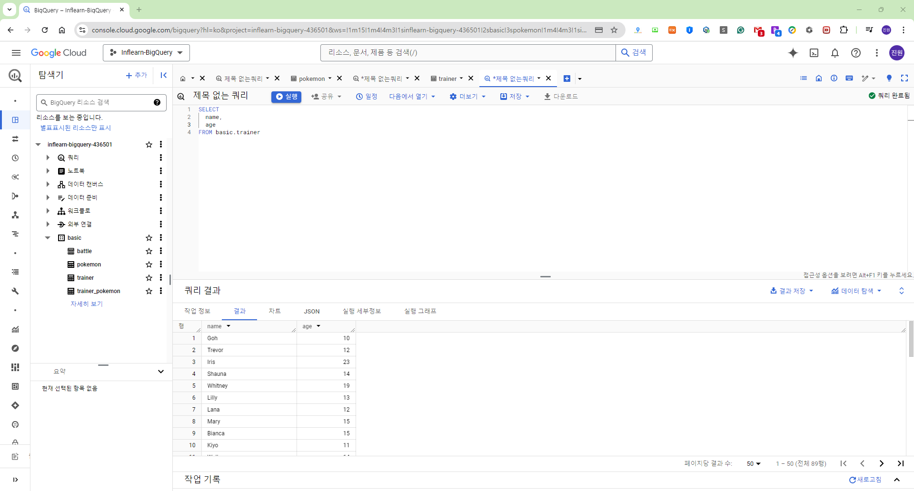
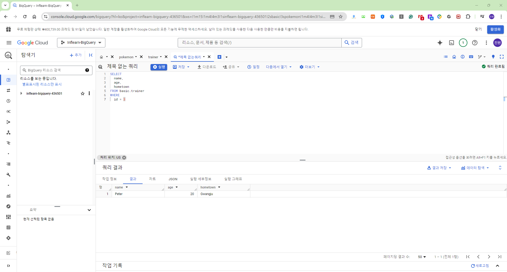
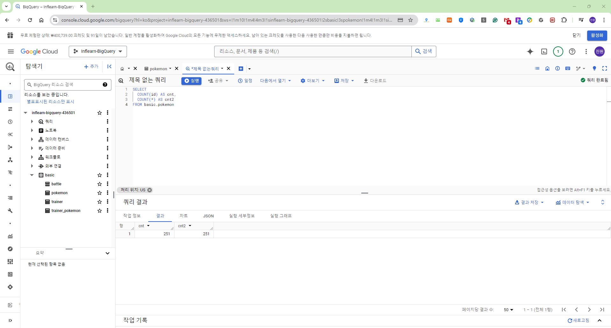
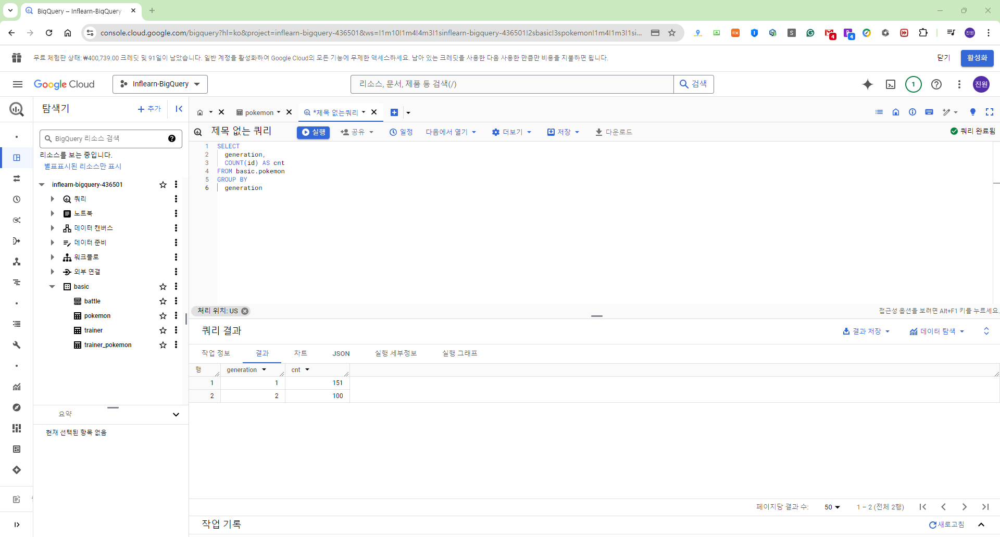
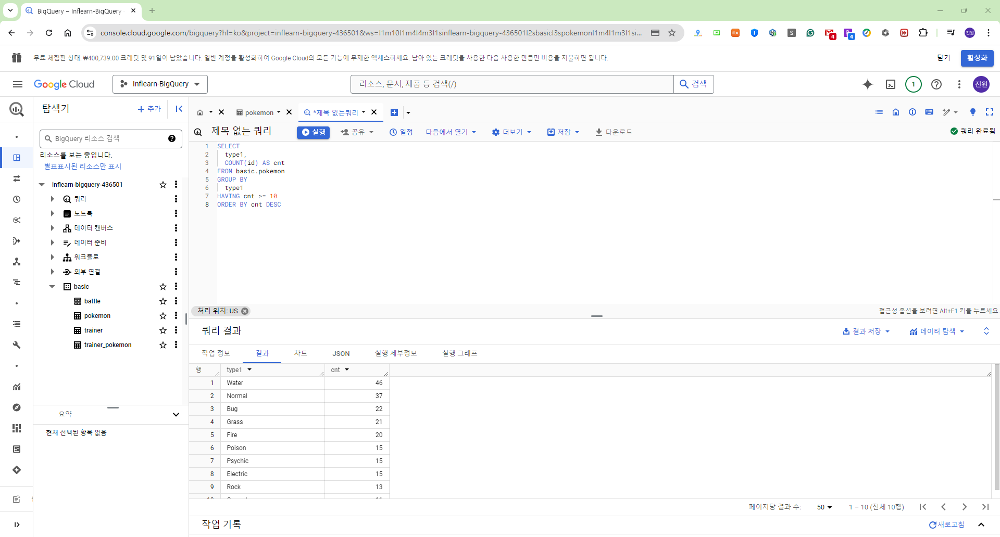
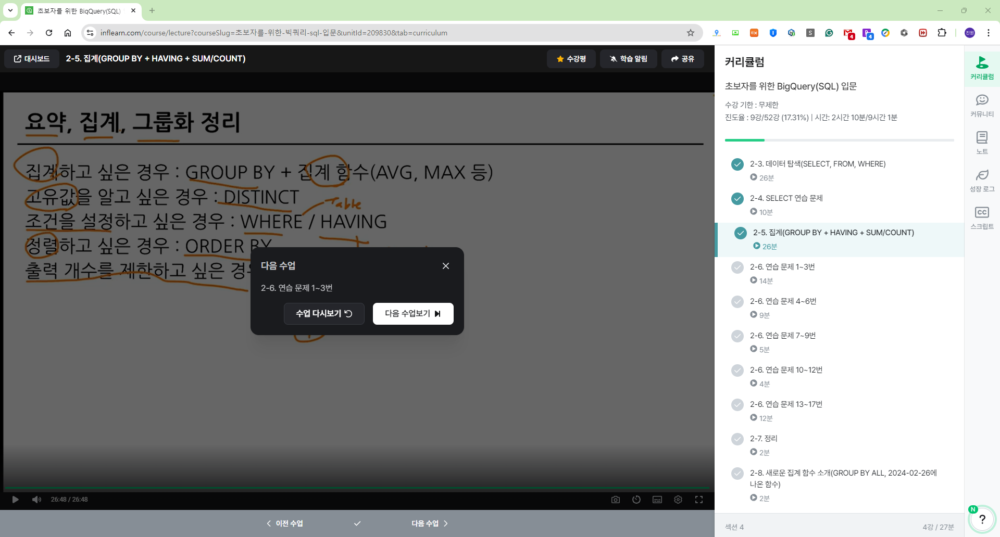

# SQL Assignment 2주차


## 1. 데이터 탐색(SELECT, FROM, WHERE)

### SQL 쿼리 구조
우선 SELECT, FROM, WHERE<br>
> SELECT<br>
&ensp; Col1 AS new_name,<br>
&ensp; Col2,<br>
&ensp; Col3<br>
FROM Dataset.Table : 어떤 테이블에서 데이터를 확인할 것인가?<br>
WHERE : 만약 원하는 조건이 있다면 어떤 조건인가?<br>
&ensp; Col = 1 : 조건문
>
> **\*** : 모든 컬럼을 출력하겠다.<br>
SELECT<br>
&ensp; \* EXCEPT (제외할 컬럼)<br>
이런 형태도 가능

**이 순서를 꼭 기억하기! (SELECT - FROM - WHERE)**

### 집합처럼 생각해보기
특정 Table에 있는 데이터를 추출


### 데이터가 여러 장소에 저장되어 있는 경우
특정 Table에 잇는 데이터를 각각 추출 후, 연결하기(추후에 배울 JOIN)


### BigQuery 작성 가이드
> inflearn-bigquery: 프로젝트 id<br>
> basic: dataset<br>
> pokemon: table<br>
> '<프로젝트 id>.<데이터셋>.<테이블>'<br>

- 프로젝트 id는 꼭 명시할 필요는 없을 수도 있음(프로젝트가 단일이라면!)
- 프로젝트를 여러개 사용한다면 명시하는 것이 좋음 => 쿼리를 실행할 때 어떤 프로젝트인지 확인하는 과정이 존재
- 프로젝트 명시 => 불편
- 프로젝트를 제외하고 사용해도 괜찮긴 함(여러 프로젝트를 쓸 때는 명시해야 한다)
- 프로젝트 id를 제외하고 작성할 때는 없어도 괜찮음
- 데이터를 활용하고 싶은 목적이 있어야 어떤 칼럼을 선택할지 알 수 있게 됨

### 가독성 있는 쿼리
- 쿼리를 잘 읽을 수 있으려면 잘 작성해야 함 => 협업할 때 특히 중요

### SQL 문법 핵심 정리
1. **FROM:**
- 데이터를 확인할 Table 명시
- 이름이 너무 길다면 AS "별칭"으로 별칭 지정 가능
- FROM Table1 AS t1
2. **WHERE**
- FROM에 명시된 Table에 저장된 데이터를 필터링(조건 설정)
- Table에 있는 컬럼을 조건 설정
3. **SELECT**
- Table에 저장되어 있는 컬럼 선택
- 여러 컬럼 명시 가능
- col1 AS "별칭"으로 컬럼의 이름도 별칭 지정 가능


## 2. SELECT 연습 문제

### 1. trainer 테이블에 있는 모든 데이터를 보여주는 SQL 쿼리를 작성해주세요.
1) trainer 테이블에 어떤 데이터가 있는지 확인해보자
2) trainer 테이블을 어디에 명시해야 할까? => FROM
3) 필터링 조건이 있을까? => 모든 데이터 => 필터링을 할 필요가 없겠다
4) 모든 데이터 => 모든 데이터 = 모든 컬럼일 수도 있겠다(추측) 쿼리 작성 => 애매하면 모든 데이터의 정의가 무엇인가?

```
SELECT
  *
FROM 'inflearn-biggquery-436501.basic.trainer'
```

### 2. trainer 테이블에 있는 트레이너의 name을 출력하는 쿼리를 작성해주세요.
1) trainer 테이블 사용
2) name 컬럼을 사용

```
SELECT
  name
FROM basic.trainer
```

### 3. trainer 테이블에 있는 트레이너의 name, age를 출력하는 쿼리를 작성해주세요.
1) trainer 테이블 사용
2) 조건 설정 없음
3) name, age 컬럼 사용

```
SELECT
  name,
  age
FROM basic.trainer
```

### 4. trainer의 테이블에서 id가 3인 트레이너의 name, age, hometown을 출력하는 쿼리를 작성해주세요.
1) trainer 테이블 사용
2) 조건 설정 => id가 3인
3) 컬럼 : name, age, hometown

```
SELECT
  name,
  age
  hometown
FROM basic.trainer
WHERE
  id = 3
```
> - name, age, hometown => 영어로 명시되어 있는 경우엔 편함
> - 현업에서는 이름, 나이를 알려주세요 => 컬럼의 의미를 파악해서 작성해야 함 => 어떤 컬럼을 요구하는지, 어떤 컬럼을 봐야하는지?

### 5. pokemon 테이블에서 "피카츄"의 공격력과 체력을 확인할 수 있는 쿼리를 작성해주세요.
1) pokemon 테이블
2) 조건? = "피카츄" kor_name = "피카츄"
3) 공격력, 체력 => 테이블에서 어떤 컬럼인지 확인해야 함 => attack, hp

```
SELECT
  attack,
  hp
FROM basic.pokemon
WHERE
  kor_name = "피카츄"
```

## 3. 집계(GROUP BY + HAVING + SUM/COUNT)

### 집계와 그룹화
**집계하다:** 모을 집, 계산할 계<br>
모아서 계산하다<br>
(=그룹화)해서 계산하다

**계산**
- 더하기, 빼기
- 최대값, 최소값
- 평균
- 갯수 세기

### 집계: GROUP BY
- **GROUP BY:** 같은 값끼리 모아서 그룹화한다
- 특정 컬럼을 기준으로 모으면서 다른 컬럼에선 집계 가능(합, 평균, MAX, MIN 등)

### 앞에서 나온 것을 SQL로 표현해보기
>SELECT<br>
&ensp; 집계할_컬럼1,<br>
&ensp; 집계 함수(COUNT, MAX, MIN 등)<br>
FROM Table<br>
GROUP BY<br>
&ensp; 집계할_컬럼1

**집계할 컬럼을 SELECT에 명시하고<br>
그 컬럼을 꼭 GROUP BY에 작성**

### DISTINCT: 고유값을 알고 싶은 경우
**DISTINCT의 뜻:** 별개의 여러 값 중에 Unique한 것만 보고 싶은 경우 사용

예시
- 1, 2, 3, 4 => DISTINCT하면? => **1, 2, 3, 4**

**DISTINCT는 중복을 제거하는 것**

>SELECT<br>
&ensp; 집계할 컬럼,<br>
&ensp; COUNT(DISTINCT count할-컬럼)<br>
FROM Table<br>
GROUP BY<br>
&ensp; 집계할 컬럼

### 그룹화(집계) 활용 포인트
데이터 분석하다가 그룹화하는 경우
- 일자별 집계(원본 데이터는 특정 시간에 어떤 유저가 한 행동이 기록, 일자별로 집계)
- 연령대별 집계(특정 연령대에서 더 많이 구매했는가?)
- 특정 타입별 집계(특정 제품 타입을 많이 구매했는가?)
- 앱 화면별 집계(어떤 화면에 유저가 많이 접근했는가?)

### 조건을 설정하고 싶은 경우: WHERE
**Table에 바로** 조건을 설정하고 싶은 경우 사용

Raw Data인 **테이블 데이터**에서 조건 설정

>SELECT<br>
&ensp; 컬럼1, 컬럼2<br>
&ensp; COUNT(컬럼1) AS col1_count<br>
FROM Table<br>
WHERE<br>
&ensp; 컬럼1 >= 3

### 조건을 설정하고 싶은 경우: HAVING
**GROUP BY한 후** 조건을 설정하고 싶은 경우 사용

>SELECT<br>
&ensp; 컬럼1, 컬럼2<br>
&ensp; COUNT(컬럼1) AS col1_count<br>
FROM Table<br>
GROUP BY 컬럼1, 컬럼2<br>
Having<br>
&ensp; col1_count > 3

### 서브 쿼리
- SELECT문 안에 존재하는 SELECT 쿼리
- FROM절에 또 다른 SELECT문을 넣을 수 있음
- 괄호로 묶어서 사용

서브 쿼리를 작성하고, 서브 쿼리 바깥에서 WHERE 조건 설정하는 것<br>
= 서브 쿼리에서 HAVING으로 하는 것

### 정렬하기: ORDER BY
>SELECT<br>
&ensp; col<br>
FROM<br>
ORDER BY <컬럼> <순서>

**순서:** DESC(내림차순), OSC(오름차순 - 보통 Default)

ORDER BY는 쿼리의 맨 마지막(아래)에 두고, 쿼리의 맨 마지막에만 작성하면 됨(중간에 필요없음)

### 출력 개수 제한하기: LIMIT
- 쿼리문의 결과 Row 수를 제한하고 싶은 경우 LIMIT 사용

**쿼리문의 제일 마지막에 작성**

>SELECT<br>
&ensp; col<br>
FROM Table<br>
LIMIT 10

### GROUP BY 연습 문제

#### 1. pokemon 테이블에 있는 포켓몬 수를 구하는 쿼리를 작성해주세요.
1) 사용할 테이블: pokemon
2) 조건: X
3) 그룹화를 할 때 사용할 컬럼: X
4) 집계할 때 사용할 계산: 수를 구한다 => COUNT, 포켓몬

```
SELECT
  COUNT(id) AS cnt,
  COUNT(*) AS cnt2
FROM basic.pokemon
```

#### 2. 포켓몬의 수가 세대별로 얼마나 있는지 알 수 있는 쿼리를 작성해주세요.
1) 사용할 테이블: pokemon
2) 조건: X
3) 그룹화를 할 때 사용할 컬럼: 세대
4) 집계할 때 사용할 계산: 수를 구한다 => COUNT

```
SELECT
  generation,
  COUNT(id) AS cnt
FROM basic.pokemon
GROUP BY
  generation
```

#### 3. 포켓몬의 수를 타입 별로 집계하고, 포켓몬의 수가 10 이상인 타입만 남기는 쿼리를 작성해주세요. 포켓몬의 수가 많은 순으로 정렬해주세요.
1) 사용할 테이블: pokemon
2) 조건(WHERE) => 테이블 원본 => 없음
3) 집계 후 조건(HAVING) => 10 이상
4) 포켓몬의 수가 많은 순으로 정렬(ORDER BY 포켓몬 수 DESC)
5) 단계적으로 실행해 보면서 가도 된다! 한 번에 정답을 맞히려고 안 해도 된다!

```
SELECT
  type1,
  COUNT(id) AS cnt
FROM basic.pokemon
GROUP BY
  type1
HAVING cnt >= 10
ORDER BY cnt DESC
```

### 요약, 집계, 그룹화 정리
- 집계하고 싶은 경우: GROUP BY + 집계 함수(AVG, MAX 등)
- 고유값을 알고 싶은 경우: DISTINCT
- 조건을 설정하고 싶은 경우: WHERE/HAVING
- 정렬하고 싶은 경우: ORDER BY
- 출력 개수를 제한하고 싶은 경우: LIMIT


## 과제 인증샷

