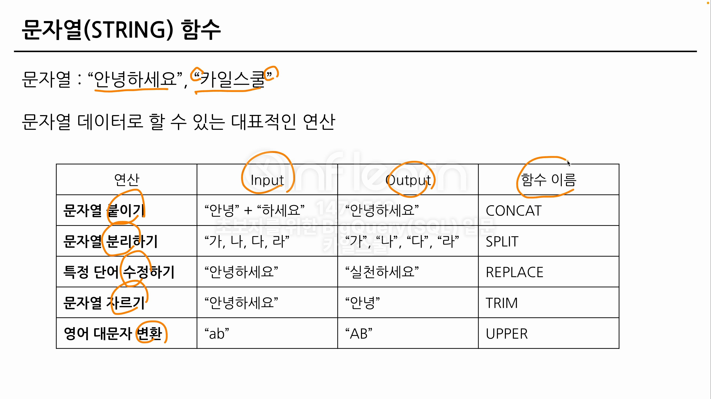
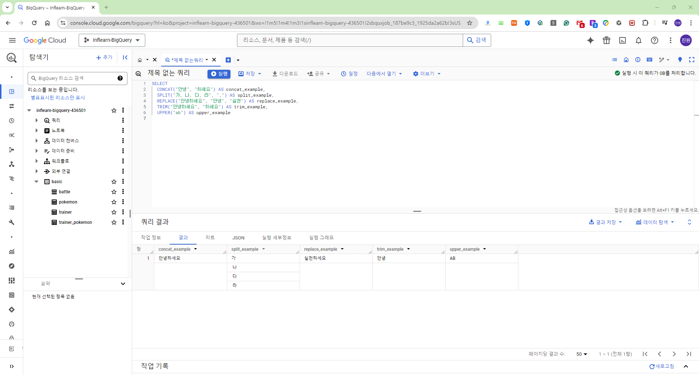
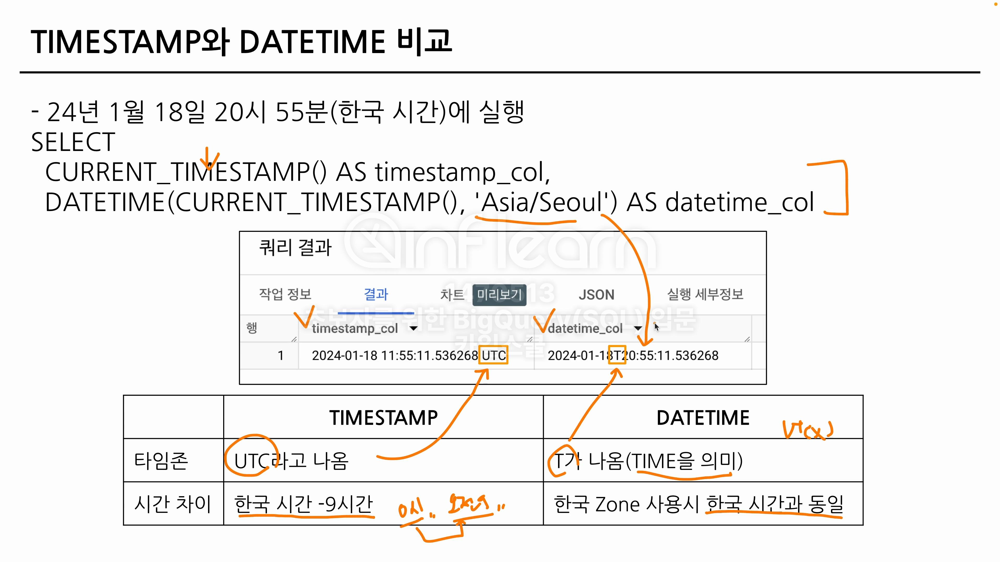

# SQL Assignment 4주차


## 1. 오류를 디버깅하는 방법

### 오류(Error)의 정의
- "방황하다, 길을 잃다"는 뜻의 라틴어(Errare)에서 유래한 단어
- 부정확하거나 잘못된 행동을 의미
- 실수와 동의어인 경우도 있음

**오류 메세지가 알려주고자 하는 것**
- 현재 작성한 방식으로 하면 답을 얻을 수 없어요 (길잡이 역할)
- 이 부분에 문제가 되어요 (문제 진단)

### 오류를 바라보는 관점
- 오류가 발생하면: **아 길잡이가 나를 더 좋은 길로 나아가게 하려는구나!**

좋은 길로 어떻게 갈까?
- 오류 메시지를 보면서 더 좋은 길로 나가자

### BigQuery Error
- 대표적인 오류 카테고리 : Syntax Error (문법 오류)
    - 문법을 지키지 않아 생기는 오류
    - Error Message를 보고 번역 또는 해석한 후, 해결 방법 찾아보기
        - 구글에 검색
        - ChatGPT에 질문
        - 지인에게 질문(커뮤니티 등)

### BigQuery Error : SELECT list must not be empty at [10:1]
- 오류 메시지 번역 : SELECT 목록은 [10:1]에서 비어 있으면 안 됩니다.
```js
SELECT
  col => 이 부분이 비어있기에 생기는 오류
FROM
WHERE
```

### Number of arguments does not match for aggregate function COUNT
```js
SELECT
  COUNT(id, kor_name)
FROM basic.pokemon
```
해석 : 집계 함수 COUNT의 인자 수가 일치하지 않습니다.

COUNT(kor_name, eng_name) => X / COUNT(1개)

### SELECT list expression references column type1 a which is neither grouped nor aggregated
```js
SELECT
  type1,
  COUNT(id) AS cnt
FROM basic.pokemon
```
해석 : SELECT 목록 식은 다음에서 그룹화되거나 집계되지 않은 열을 참조합니다.

GROUP BY에 적절한 컬럼을 명시하지 않았을 경우 발생하는 오류

### Syntax error: Expected end of input but got keyword SELECT
```js
SELECT
  type1,
  COUNT(id) AS cnt
FROM basic.pokemon
GROUP BY
  type1

SELECT
  *
FROM basic.trainer
```
해석 : 입력이 끝날 것으로 예상되었지만 SELECT 키워드가 입력되었습니다.

- SELECT 근처 확인하기
- 하나의 쿼리엔 SELECT가 1개만 있어야 함
- 혹은 쿼리가 끝나는 부분에 ; 붙이고 실행할 부분만 드래그 앤 드랍해서 실행하기

### Syntax error: Expected end of input but got keyword WHERE at [5:1]
```js
SELECT
  *
FROM basic.trainer LIMIT 10
WHERE
  id = 3
```
해석 : 입력이 끝날 것으로 예상되었지만 [5:1]에서 키워드 WHERE를 얻었습니다.

### Syntax error: Expected ")" but got end of script at [8:11]
```js
SELECT
  name,
FROM (
  SELECT
    *
  FROM basic.trainer
WHERE
  id = 3
```
해석 : ")"가 예상되지만 [8:11]에 스크립트가 끝났습니다.

괄호를 작성하지 않은 경우


## 2. 데이터 타입과 데이터 변환(CAST, SAFE_CAST)

### 변환을 위한 함수
- SELECT 문에서 데이터를 변환시킬 수 있음
    - 또는 WHERE의 조건문에도 사용할 수도 있음
- 데이터의 타입에 따라 다양한 함수가 존재

### 데이터 타입


### 데이터 타입이 중요한 이유
- 보이는 것과 저장된 것의 차이가 존재

- 엑셀에서 보면 빈 값 => ""일 수도 있고, NULL일 수도 있음
- 1이라고 작성된 경우 => 숫자 1일 수도 있고, 문자 1일 수도 있음
- 2023-12-31 => DATE 2023-12-31일 수도 있고, 문자 2023-12-31일 수도 있음

- 내 생각과 다른 경우 데이터의 타입을 서로 변경해야 함

### 자료 타입 변경하기
- 자료 타입을 변경하는 함수 : CAST
```js
SELECT
  CAST(1 AS STRING) # 숫자 1을 문자 1로 변경
```

만약 아래 쿼리를 실행하면?
```js
SELECT
  CAST("카일스쿨" AS INT64)
```
카일스쿨은 숫자로 변경하려고 해도 불가능 => 오류 발생

- 더 안전하게 데이터 타입 변경하기 : SAFE_CAST
- SAFE_가 붙은 함수는 변환이 실패할 경우 NULL 반환
```js
SELECT
  SAFE_CAST("카일스쿨" AS INT64)
```

### 수학 함수
- 수학 함수는 수학 연산(평균, 표준편차, 코사인 등)이 존재
```
TIP)
x/y 대신 SAFE_DIVIDE 함수 사용하기
SAFE_DIVIDE(x, y)
```
x, y 중 하나라도 0인 경우 그냥 나누면 zero error가 발생


## 3. 문자열 함수(CONCAT, SPLIT, REPLACE, TRIM, UPPER)

### 문자열(STRING) 함수


### 문자열(STRING) 함수 - CONCAT
문법
```js
CONCAT(컬럼1, 컬럼2, ...)
```

쿼리 예시
```js
SELECT
  CONCAT("안녕", "하세요") AS concat_example
```
=> 결과 : "안녕하세요"

### 문자열(STRING) 함수 - SPLIT
문법
```js
SPLIT(문자열 원본, 나눌 기준이 되는 문자)
```

쿼리 예시
```js
SELECT
  SPLIT("가, 나, 다, 라", ",") AS split_example
```
=> 결과 : "가", "나", "다", "라" (배열)

### 문자열(STRING) 함수 - REPLACE
문법
```js
REPLACE(문자열 원본, 찾을 단어, 바꿀 단어)
```

쿼리 예시
```js
SELECT
  REPLACE("안녕하세요", "안녕", "실천") AS replace_example
```
=> 결과 : "실천하세요"

### 문자열(STRING) 함수 - TRIM
문법
```js
TRIM(문자열 원본, 자를 단어)
```

쿼리 예시
```js
SELECT
  TRIM("안녕하세요", "하세요") AS trim_example
```
=> 결과 : "안녕"

### 문자열(STRING) 함수 - UPPER
문법
```js
UPPER(문자열 원본)
```

쿼리 예시
```js
SELECT
  UPPER("ab") AS upper_example
```
=> 결과 : "AB"

### 문자열(STRING) 함수의 예시 쿼리



## 4. 날짜 및 시간 데이터 이해하기(1)(타임존, UTC, Millisecond, TIMESTAMP/DATETIME)

### 시간 데이터 다루기
- 시간 데이터도 세부적으로 나눌 수 있음
- DATE, DATETIME, TIMESTAMP 등

- **DATE :** DATE만 표시하는 데이터, 2023-12-31
- **DATETIME :** DATE와 TIME까지 표시하는 데이터, Time Zone 정보 없음, 2023-12-31 14:00:00
- **TIME :** 날짜와 무관하게 시간만 표시하는 데이터, 23:59:59.00

### 시간 데이터 다루기 - 타임존
**GMT: Greenwich Mean Time(한국 시간 : GMT +9)**
- 영국의 그리니치 천문대(경도 0도)를 기준으로 지역에 따른 시간의 차이를 조정하기 위해 생긴 시간의 구분선(1884년 채택)
- 영국 근처에서 자주 활용

**UTC: Universal Time Coordinated(한국 시간 : UTC +9)**
- 국제적인 표준 시간
- 협정 세계시
- 타임존이 존재한다 = 특정 지역의 표준 시간대

**TIMESTAMP**
- 시간 도장
- UTC부터 경과한 시간을 나타내는 값
- Time Zone 정보 있음
- 2023-12-31 14:00:00 UTC

### 시간 데이터 다루기 - millisecond, microsecond
**millisecond(ms)**
- 시간의 단위, 천 분의 1초(1,000ms = 1초)
- 우리가 아는 초보다 더 짧은 시간 단위
- 눈을 깜빡이는 시간이 약 100ms
- 빠른 반응이 필요한 분야에서 사용(초보다 더 정확하게)
- Millisecond => TIMESTAMP => DATETIME으로 변경

**microsecond(μs)**
- 1/1,000ms, 1/1,000,000초


### 시간 데이터끼리의 변환
많은 회사들의 Table에 시간이 TIMESTAMP로 저장된 경우가 많음(혹은 DATETIME)
- TIMESTAMP <=> DATETIME 변환을 해야할 수 있음

### TIMESTAMP와 DATETIME 비교



## 과제 인증샷
