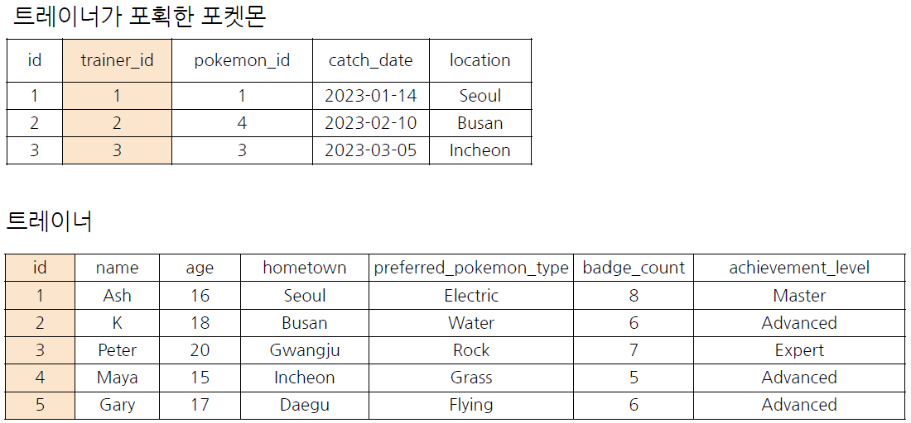

# SQL Assignment 6주차

## 1. JOIN 이해하기

### SQL JOIN
- 간단하게 **"서로 다른 데이터 테이블을 연결하는 것"**
- **공통적으로** 존재하는 컬럼(=Key)이 있다면, JOIN할 수 있음
- 보통 id 값을 Key로 많이 사용하고, 특정 범위(예: Date)로 JOIN도 가능함

### 포켓몬으로 JOIN 이해하기
- 트레이너: 포켓몬을 포획해 육성하는 사람들
- 포켓몬은 다양한 곳에서 나타남
- 트레이너는 포획한 포켓몬을 육성할 수 있음

- 트레이너 데이터 + 포켓몬 데이터 => 두 데이터를 연결할 수 있는 공통값이 없음!
- 트레이너가 포획한 포켓몬 데이터(=트레이너와 포켓몬을 연결할 수 있음)

- 트레이너가 포획한 포켓몬 기준으로 트레이너 데이터를 연결하기(JOIN)
- 연결할 수 있는 Key = trainer_id, id


- trainer_id 컬럼 기준으로 트레이너 데이터를 연결!


### JOIN을 해야하는 이유 - 데이터 저장되는 형태에 대한 이해
- 관계형 데이터베이스(DBMS) 설계시 정규화 과정을 거침
    - 정규화는 **중복을 최소화하게 데이터를 구조화**
    - User Table은 유저 데이터만, Order Table은 주문 데이터만
    - 따라서 데이터를 다양한 Table에 저장해서 필요할 때 JOIN해서 사용

- 데이터 분석하는 관점에선 미리 JOIN되어 있는 것이 좋을 수 있지만, 개발 관점에선 분리되어 있는 것이 좋음
- 대신 데이터 웨어하우스에서 JOIN + 필요한 연산을 해서 "데이터 마트"를 만들어서 활용


## 2. 다양한 JOIN 방법(LEFT, RIGHT, INNER, CROSS JOIN)

### 다양한 SQL JOIN 방법
- **(INNER) JOIN:** 두 테이블의 **공통** 요소만 연결
- **LEFT/RIGHT (OUTER) JOIN:** **왼쪽/오른쪽** 테이블 **기준**으로 연결
- **FULL (OUTER) JOIN:** **양쪽** 기준으로 연결
- **CROSS JOIN:** 두 테이블의 각각의 **요소**를 **곱하기**


### JOIN 집합 관점으로 생각하기


## 3. JOIN 쿼리 작성하기

### SQL JOIN 쿼리 작성하는 흐름


### SQL JOIN 문법
- FROM 하단에 JOIN 할 Table을 작성하고 ON 뒤에 공통된 컬럼(Key)를 작성
```js
SELECT
  A.col1,
  A.col2,
  B.col11,
  B.col12
FROM table1 AS A
LEFT JOIN table2 AS B
ON A.key = B.key # Alias를 사용할 수 있음
```
- 테이블 이름이 길 수 있기 때문에 별칭(Alias)를 정의해줄 수 있음

### 여러 JOIN별 쿼리 예시


### BigQuery에서 JOIN하기
```js
SELECT
  tp.*,
  t.* EXCEPT(id),
  p.* EXCEPT(id)
FROM basic.trainer_pokemon AS tp
LEFT JOIN basic.trainer AS t
ON tp.trainer_id = t.id
LEFT JOIN baic.pokemon AS p
ON tp.pokemon_id = p.id 
```

## 4. JOIN을 처음 공부할 때 헷갈렸던 부분

### 1) 여러 JOIN 중 어떤 것을 사용해야 할까?
- 하려고 하는 작업의 목적에 따라 JOIN을 선택해보기
    - 교집합: INNER
    - 모두 다 조합: CROSS
    - 그게 아니라면 LEFT 또는 RIGHT : LEFT를 추천, 하나를 계속 활용하는 것을 추천
- 쿼리 작성 템플릿에 예상하는 결과를 작성하고, 중간 결과도 생각하면서 찾아보기

### 2) 어떤 Table을 왼쪽에 두고, 어떤 Table이 오른쪽에 가야할까?
- LEFT JOIN의 경우
    - 기준이 되는 Table을 왼쪽에 두기
- 기준에는 기준값이 존재하고, 우측에 데이터를 계속 추가

### 3) 여러 Table을 연결할 수 있는걸까?
- JOIN의 개수에 한계는 없음
- 너무 많이 JOIN하고 있는지 확인
```js
SELECT
  table_a.col1,
  table_a.col2,
FROM table_a
LEFT JOIN table_b
ON table_a.key = table_b.key
LEFT JOIN table_c
ON table_a.key = table_c.key
```

### 4) 컬럼은 모두 다 선택해야 할까?
- 컬럼 선택은 데이터를 추출해서 무엇을 하고자?하냐에 따라 다름
- JOIN이 잘 되었나 확인하기 위해 처음엔 많은 컬럼을 선택해도 괜찮으나, **사용하지 않을 컬럼은 선택하지 않는 것**이 BigQuery에서 비용을 줄일 수 있음
- id 같은 값은 Unique한지 확인하기 위해 자주 사용되므로 id는 자주 사용하는 편
```js
SELECT
  table_a.* EXCEPT(컬럼),
  table_b.* EXCEPT(컬럼),
FROM table_a
LEFT JOIN table_b
ON table_a.key = table_b.key
```

### 5) NULL이 대체 뭐죠?
- NULL: 값이 없음, 알 수 없음
- 0이나 공백과 다르게 값이 아예 없는 것
- JOIN에선 연결할 값이 없는 경우 나타남


## 5. JOIN 연습문제

### 1) 트레이너가 보유한 포켓몬들은 얼마나 있는지 알 수 있는 쿼리를 작성해주세요
- 쿼리를 작성하는 목표, 확인할 지표: 포켓몬들이(이름 명시) 얼마나 있는지 알고 싶다! 포켓몬의 수.
- 쿼리 계산 방법: trainer_pokemon(status가 Active, Training) + pokemon JOIN => 그 후에 GROUP BY 집계(COUNT)
- 데이터의 기간: X
- 사용할 테이블: trainer_pokemon, pokemon
- Join KEY: trainer_pokemon.pokemon_id = pokemon.id
- 데이터 특징: 
    - 보유했다의 정의는 status가 Active, Training인 경우를 읨
    - Released는 방출했다는 것을 의미

```js
SELECT
  kor_name,
  COUNT(tp.id) AS pokemon_cnt
FROM (
SELECT
  id,
  trainer_id,
  pokemon_id,
  status
FROM basic.trainer_pokemon
WHERE
  status IN ("Active", "Training")
) AS tp
LEFT JOIN basic.pokemon AS p
ON tp.pokemon_id = p.id
GROUP BY
  kor_name
ORDER BY
  pokemon_cnt DESC
```

### 2) 각 트레이너가 가진 포켓몬 중에서 'Grass' 타입의 포켓몬 수를 계산해주세요 (단, 편의를 위해 type1 기준으로 계산해주세요)
- 쿼리를 작성하는 목표, 확인할 지표: 트레이너가 보유한 포켓몬 중에서 Grass 타입의 포켓몬 수를 알고 싶다!
- 쿼리 계산 방법: 트레이너가 보유한 포켓몬 조건 설정 => Grass 타입으로 WHERE 조건 걸어서 COUNT
- 데이터의 기간: X
- 사용할 테이블: trainer_pokemon, pokemon
- Join KEY: trainer_pokemon.pokemon_id = pokemon.id
- 데이터 특징: 1번 문제와 동일

```js
SELECT
  p.type1,
  COUNT(tp.id) AS pokemon_cnt
FROM (
SELECT
  id,
  trainer_id,
  pokemon_id,
  status
FROM basic.trainer_pokemon
WHERE
  status IN ("Active", "Training")
) AS tp
LEFT JOIN basic.pokemon AS p
ON tp.pokemon_id = p.id
WHERE
  type1 = "Grass"
GROUP BY
  type1
ORDER BY
  2 DESC
```

### 3) 트레니언의 고향(hometown)과 포켓몬을 포획한 위치(location)를 비교하여, 자신의 고향에서 포켓몬을 포획한 트레이너의 수를 계산해주세요.
- 쿼리를 작성하는 목표, 확인할 지표: 트레이너 고향과 포켓몬의 포획 위치가 같은 트레이너의 수를 계산하기!
- 쿼리 계산 방법: trainer(hometown), trainer_pokemon(location) JOIN => hometown = lcoation => 트레이너의 수 COUNT
- 데이터의 기간: X
- 사용할 테이블: trainer, trainer_pokemon
- Join KEY: trainer_id = trainer_pokemon.trainer_id
- 데이터 특징: status 상관없이 구해주세요

```js
SELECT
  COUNT(DISTINCT tp.trainer_id) AS trainer_uniq
FROM basic.trainer AS t
LEFT JOIN basic.trainer_pokemon AS tp
ON t.id = tp.trainer_id
WHERE
  location IS NOT NULL
  AND t.hometown = tp.location
```

### 4) Master 등급인 트레이너들은 어떤 타입(type1)의 포켓몬을 제일 많이 보유하고 있을까요?
- 쿼리를 작성하는 목표, 확인할 지표: Master 등급의 트레이너들이 가장 많이 보유하고 있는 타입
- 쿼리 계산 방법: trainer + pokemon + trainer_pokemon => Master 조건 설정(WHERE) => type1 GROUP BY + COUNT
- 데이터의 기간: X
- 사용할 테이블: trainer, pokemon, trainer_pokemon
- Join KEY: trainer_id = trainer_pokemon.trainer_id, pokemon.id = trainer_pokemon.pokemon_id
- 데이터 특징: 보유했다의 정의는 1번 문제의 정의와 동일

```js
SELECT
  type1,
  COUNT(tp.id) AS pokemon_cnt
FROM (
SELECT
  id,
  trainer_id,
  pokemon_id,
  status
FROM basic.trainer_pokemon
WHERE
  status IN ("Active", "Training")
) AS tp
LEFT JOIN basic.pokemon AS p
ON tp.pokemon_id = p.id
LEFT JOIN basic.trainer AS t
ON tp.trainer_id = t.id
WHERE
  t.achievement_level = "Master"
GROUP BY
  type1
ORDER BY
  2 DESC
LIMIT 1
```

### 5) Incheon 출신 트레이너들은 1세대, 2세대 포켓몬을 각각 얼마나 보유하고 있나요?
- 쿼리를 작성하는 목표, 확인할 지표: Incheon 출신 트레이너들이 보유하고 있는 포켓몬 중에 세대 구분을 하고 싶다(1, 2)
- 쿼리 계산 방법: trainer + trainer_pokemon + pokemon => 세대(generation)로 GROUP BY COUNT
- 데이터의 기간: X
- 사용할 테이블: trainer, trainer_pokemon, pokemon
- Join KEY: trainer_id = trainer_pokemon.trainer_id, pokemon.id = trainer_pokemon.pokemon_id
- 데이터 특징: 보유의 정의

```js
SELECT
  generation,
  COUNT(tp.id) AS pokemon_cnt
FROM (
SELECT
  id,
  trainer_id,
  pokemon_id,
  status
FROM basic.trainer_pokemon
WHERE
  status IN ("Active", "Training")
) AS tp
LEFT JOIN basic.trainer AS t
ON tp.trainer_id = t.id
LEFT JOIN basic.pokemon AS p
ON tp.pokemon_id = p.id
WHERE
  t.hometown = "Incheon"
GROUP BY
  generation
```


## 6. 정리
- JOIN: 여러 TABLE을 연결해야 할 때 사용하는 문법
- Key: 공통적으로 가지고 있는 컬럼

**문법 예시**
```js
SELECT
  t1.col, t2.col2
FROM table1 AS t1
LEFT JOIN table2 AS t2
ON t1.key = t2.key
```

**JOIN 종류**
- INNER
- LEFT/RIGHT
- FULL
- CROSS

## 과제 인증샷
