## 1. 가독성을 챙기기 위한 SQL 스타일 가이드

### 데이터 결과 검증을 하기 전
**실수가 언제 발생하는가?**
- 문법을 잘못 알고 있는 경우
- 데이터를 파악하지 않고 쿼리를 작성하는 경우
- 쿼리가 복잡한 경우

### 데이터 결과 검증을 하기 전에
**다른 사람의 쿼리를 봐아햐는 경우 또는 내 쿼리를 다른 사람이 보는 경우**
- 쿼리를 가독성 있게 잘 작성했으면 별도의 설명이 없어도 이해할 가능성이 존재
- 매번 설명을 해야하면, 이 쿼리를 보는 사람들이 많아질수록 내 시간을 쓰게 됨
- 쿼리를 변경해야 할 경우에 특정 부분만 바꿨는지, 전체를 바꿨는지도 파악하는 것이 쉬우면 좋음 

### 가독성을 챙기기 위한 SQL 스타일 가이드
**SQL 스타일 가이드**
- https://www.sqlstyle.guide/

**Mozilla(Firefox)의 SQL 스타일 가이드
- https://docs.telemetry.mozilla.org/concepts/sql_style.html

### 1) 예약어는 대문자로 작성
- SQL에서 문법적인 용도로 사용하고 있는 문자들은 대문자로 작성
- **예약어의 대표적인 예시: SELECT, FROM, WHERE, 각종 함수**
```js
SELECT
  col
FROM table
WHERE
```

### 2) 컬럼 이름은 snake_case로 작성
- 컬럼 이름은 CamelCase가 아닌 **snake_case**로 작성
- (단, 회사의 기준이 CamelCase면 사용. 일관성이 중요)
```js
SELECT
  col1 AS event_status
FROM table
```

### 3) 명시적 vs 암시적인 이름
- Alias로 별칭을 지을 때는 명시적인 이름을 적용
- AS a, AS b 등 컬럼의 의미를 한번 더 생각하게 하는 이름이 아닌 명시적인 것을 사용
- JOIN할 때 테이블의 이름도 명시적으로 할 수 있다면 명시적으로 진행하기
- AS를 생략해서 별칭을 설정할 수도 있는데, AS를 쓰는 것도 명시적인 표현

### 4) 왼쪽 정렬
- 기본적으로 왼쪽 정렬을 기준으로 작성
```js
SELECT
  col
FROM table
WHERE 1=1

Not Good
SELECT col
FROM table
WHERE 1=1
```

### 5) 예약어나 컬럼은 한 줄에 하나씩 권장
- 컬럼은 바로 주석처리할 수 있는 장점이 있기에 한 줄에 하나씩 작성
```js
SELECT
  col1,
  col2,
  col3
FROM table
WHERE

Not Good
SELECT col, col2, col3
FROM table
```

### 6) 쉼표는 컬럼 바로 뒤에
- 의견이 갈리는 부분. 쉼표 앞 vs 뒤
- BigQuery는 마지막 쉼표를 무시해서 뒤에 작성해도 무방
```js
SELECT
  col1,
  col2,
  col3, #BigQuery는 정상 동작
FROM table

vs

SELECT
  col1
  , col2
  , col3
FROM table
```


## 2. 가독성을 챙기기 위한 WITH 문 & 파티션

### WITH 구문
SQL 쿼리를 작성하다 생기는 일 => 점점 복잡해짐(가독성 하락)
- 만약 아래 쿼리가 다른 곳에서도 필요하면 복사 붙여넣
```js
SELECT
  col, col2
FROM (
  SELECT
    col, col2, col3 ...
  FROM
    Table
)
```

WITH 문을 사용해 쿼리를 정의해서 재사용 가능
```js
WITH temp_table AS (
  SELECT
    col, col2, col3 ...
  FROM
    Table
)

SELECT
  col, col2
FROM temp_table
```

- CTE(Common Table Expression)라고 표현
- SELECT 구문에 이름을 정해주는 것과 유사
- 쿼리 내에서 반복적으로 사용할 수 있음

### WITH 구문 사용 방법
```js
WITH name_a AS (
  SELECT
    col
  FROM Table
), name_b AS (
  SELECT
    col2
  FROM Table2
)

SELECT
  col
FROM name_a
```

### PARTITION
- Table엔 Partition이란 것이 존재할 수 있음

- 창고에 수많은 물건이 매일 많이 들어옴
- 특정 시기에 들어온 물건을 찾고 싶다면?
- 애초에 일자별로 정리하면 됨

### PARTITION을 사용하면 좋은 점
- 1) 쿼리 성능 향상
    - 전체 데이터를 스캔하는 것보다 파티션을 설정한 곳만 스캔하는 것이 더 빠름
- 2) 데이터 관리 용이성
    - 특정 일자의 데이터를 모두 변경하거나 삭제해야 하면 파티션을 설정해서 삭제할 수 있음
- 3) 비용
    - 파티션에 해당되는 데이터만 스캔해서 비용을 줄일 수 있음
    - (BigQuery는 쿼리 용량에 비례해서 과금)

### PARTITION Table에서 쿼리하기
- WHERE 절에 파티션 컬럼에 대해 조건을 설정해서 사용
- 아래 쿼리는 "2023-12-19"부터 하루 전날의 데이터를 추출하는 쿼리
- (저장된 데이터는 더 과거 데이터라 이 쿼리를 돌릴 때 결과는 나오지 않음)
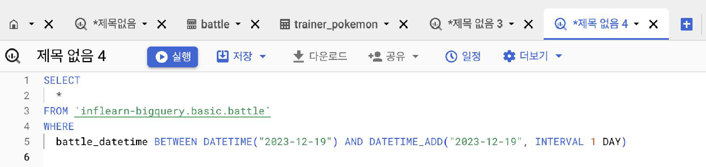


## 3. 데이터 결과 검증 정의

### 데이터 결과 검증(Data Result Validation)의 정의
- SQL 쿼리 후 얻은 결과가 예상과 일치하는지 확인하는 과정
- 목적: 분석 결과의 정확성, 신뢰성 확보
- 방법은 심플
    - 내가 기대하는 예상 결과를 정의
    - 쿼리 작성
    - 두 개가 일치하는지 비교
- 제일 중요한 부분
    - 문제를 잘 정의하고, 미리 작성해보기
    - 도메인 특수성(이런 규칙 등) 잘 파악하기
    - SQL 쿼리 템플릿과 맥락이 거의 유사

### 데이터 결과를 검증하는 흐름
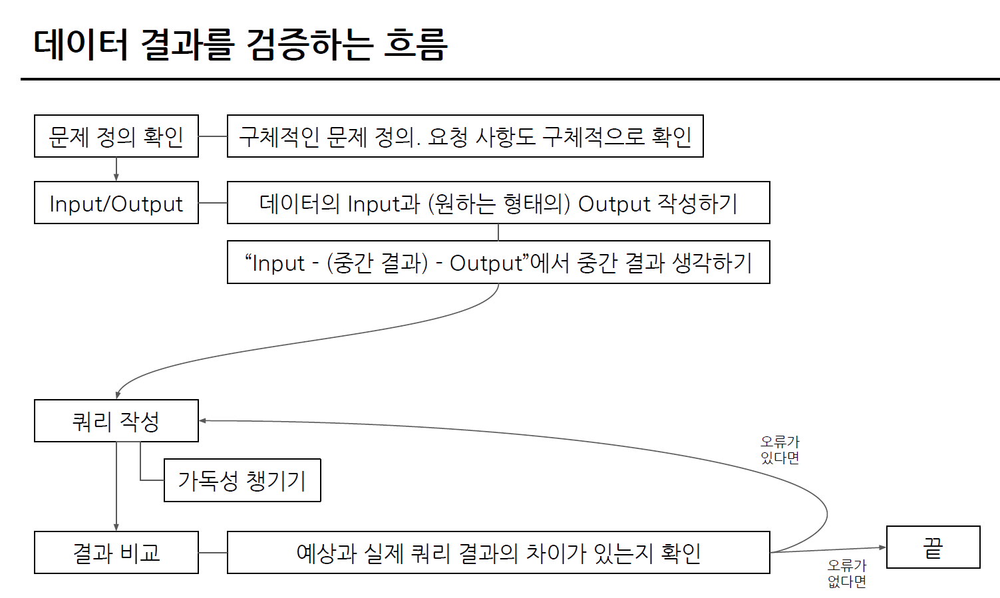

### 데이터 결과 검증할 때 자주 활용하는 SQL 쿼리
대표적으로 활용하는 SQL 문법

1) COUNT(*): 행 수를 확인. 의도한 데이터의 행 개수가 맞는가?
2) NOT NULL: 특정 컬럼에 NULL이 존재하는가? 필수 필드가 비어있지 않는가?
3) DISTINCT: 데이터의 고유값을 확인해 중복 여부 확인
4) IF문, CASE WHEN: 의도와 같다면 TRUE, 아니면 FALSE
```
1) + 3)
=> SELECT COUNT(DISTINCT col), COUNT(col) 두 컬럼을 보고 개수를 비교
```

#### 제가 데이터 결과 검증을 할 때 활용하는 방식
1) 특정 user_id로 필터링을 걸어서 확인
- 1명의 데이터 확인(예: WHERE user_id = 402)
- 결과를 예상할 때 Raw 데이터에서 하나씩 눈으로 세고 적어둠(예상 결과)
- 1명의 데이터의 예상 결과와 쿼리 결과가 동일한지 확인
- 다른 user_id 3~4건 더 추가해서 확인(여러 케이스가 존재할 수 있음)
- 3~4개에서 동일한 결과가 나오면 user_id 조건을 삭제

2) 샘플 데이터 생성하기
- WITH 문을 사용해 예시 데이터를 생성한 후, 결과를 예상하고 쿼리 작성
- 복잡한 데이터에서 하기 전에, 쿼리 자체가 올바른지 확인할 때 주로 사용
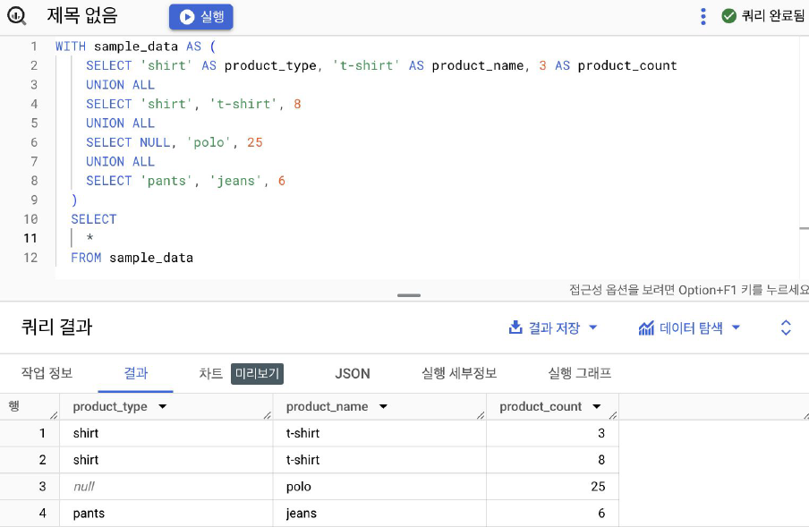


## 데이터 결과 검증 예시

### 데이터 결과 검증 예시 문제
여러분은 포켓몬 트레이너들의 배틀 성적을 분석하는 작업을 맡게 되었습니다.<br>
각 트레이너가 진행한 배틀의 승리 비율을 계산해야 하며, 배틀에 참여한 횟수가 9회 이상인 경우만 계산합니다.

**떠올릴 수 있는 생각**<br>
승리 비율(= 승리한 횟수 / 총 배틀 횟수)을 바로 구하면 되겠다!<br>
=> **이 문제는 간단한 문제라서 이렇게 해도 틀릴 가능성이 적음. 그러나 현업에서 쿼리를 작성할 때는 복잡할 때도 있으니 데이터 결과 검증을 시도하면서 풀어보기.**

**제가 생각한 데이터 결과 검증 프로세스 흐름**
- 1) 전체 데이터 파악
- 2) 특정 user_id 선정
- 3) 승률 직접 COUNT : 결과 예상
- 4) 쿼리 작성
- 5) 실제와 비교
- 6) 맞다면 특정 유저 조건 제외

#### 1) 전체 데이터 파악
- 파악할 테이블 : battle 테이블
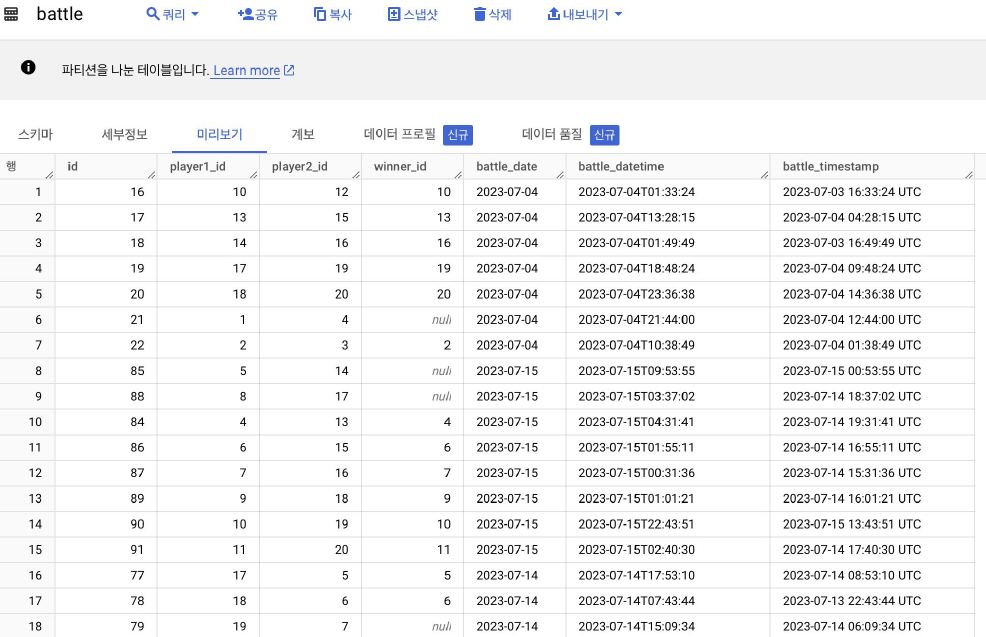

#### 2) 특정 user_id 선정
- 특정 user_id(battle에선 playerN_id)를 선정
- 회사에선 자신의 user_id를 사용하지만, 여기선 임의로 선택. 7
```js
SELECT
  *
FROM 'basic.battle'
WHERE
  player1_id = 7
```
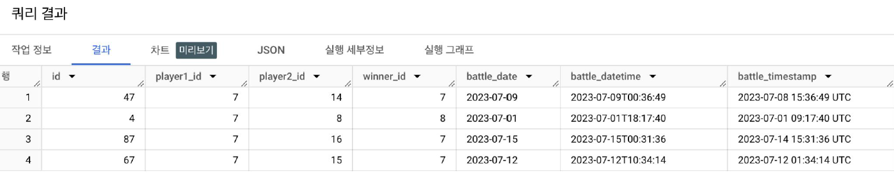

- 앞의 쿼리는 틀릴 수 있음. 테이블 다시 확인해보기.


```js
SELECT
  *
FROM 'basic.battle'
WHERE
  (player1_id = 7) OR (player2_id = 7)
```
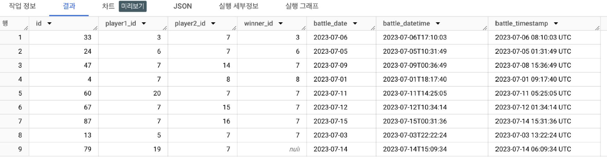

### 3) 승률 직접 COUNT : 결과 예상
- player_id(player1_id, player2_id)가 7인 유저의 승률
- 총 9회 중 5번 = 5/9 = 0.555556

### 4) 쿼리 작성
- 트레이너가 승리한 비율 구하기
    - 트레이너가 참여한 배틀의 수 구하기
    - 트레이너가 승리한 배틀의 수 구하기
    - 두 개 조합해서 승리한 비율 구할 수 있음
    - 단, 이 쿼리를 어떻게 해야할까? 쉽게 가능할까?
- 배틀의 수가 9 이상만 추출
- (예상 정답) player_id가 7의 승리한 비율은 0.55556이 나와야 함

- 통합 데이터 생성(player1, 2 구분을 하지 않아도 되는 테이블 => trainer_id 생성)
```js
SELECT
  *
FROM (
  SELECT
    id AS battle_id,
    player1_id AS trainer_id,
    winner_id
  FROM 'basic.battle'
  UNION ALL
  SELECT
    id AS battle_id,
    player2_id AS trainer_id,
    winner_id
  FROM 'basic.battle'
)
ORDER BY battle_id
```
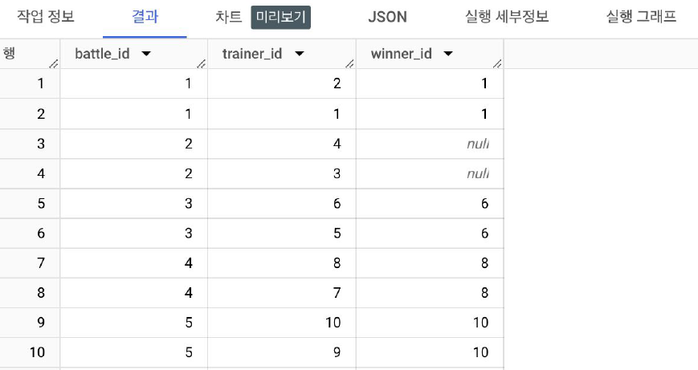

- trainer_id = 7의 총 배틀 횟수를 구하는 쿼리
```js
WITH battle_basic AS (
  SELECT
    id AS battle_id,
    player1_id AS trainer_id,
    winner_id
  FROM 'basic.battle'
  UNION ALL
  SELECT
    id AS battle_id,
    player2_id AS trainer_id,
    winner_id
  FROM 'basic.battle'
)

SELECT
  trainer_id,
  COUNT(*) AS total_battles,
  COUNT(DISTINCT battle_id) AS unique_battles
FROM battle_basic
WHERE trainer_id = 7
GROUP BY
  trainer_id
```
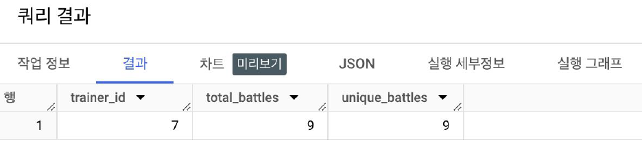

- trainer_id와 winner_id를 조합해서 WIN,LOSE, DRAW를 만들어보면 어떨까?
```js
WITH battle_basic AS (
  SELECT
    id AS battle_id,
    player1_id AS trainer_id,
    winner_id
  FROM 'basic.battle'
  UNION ALL
  SELECT
    id AS battle_id,
    player2_id AS trainer_id,
    winner_id
  FROM 'basic.battle'
)

SELECT
  *,
  CASE
    WHEN trainer_id = winner_id THEN "WIN"
    WHEN winner_id IS NULL THEN "DRAW"
    ELSE "LOSE"
  END AS battle_result
FROM battle_basic
WHERE trainer_id = 7
```
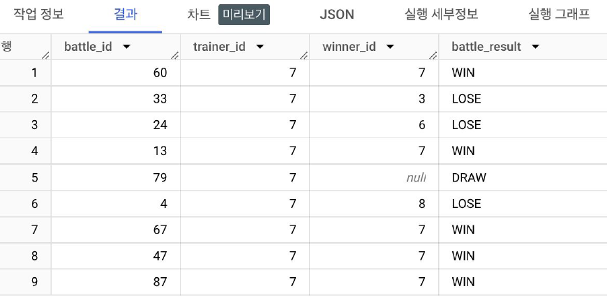

### 4) 쿼리 작성, 5) 실제와 비교
- COUNTIF를 사용해 값 구하기
```js
WITH battle_basic AS (
  SELECT
    ... # 길어져서 생략
  FROM 'basic.battle'
), battle_with_result AS (
SELECT
  *,
  CASE
    WHEN trainer_id = winner_id THEN "WIN"
    WHEN winner_id IS NULL THEN "DRAW"
    ELSE "LOSE"
  END AS battle_result
FROM battle_basic
WHERE trainer_id = 7
)

SELECT
  trainer_id,
  COUNTIF(battle_result = "WIN") AS win_count,
  COUNT(battle_id) AS total_battle_count,
  COUNTIF(battle_result = "WIN") / COUNT(DISTINCT battle_id) AS win_ratio
FROM battle_with_result
GROUP BY
  trainer_id
```
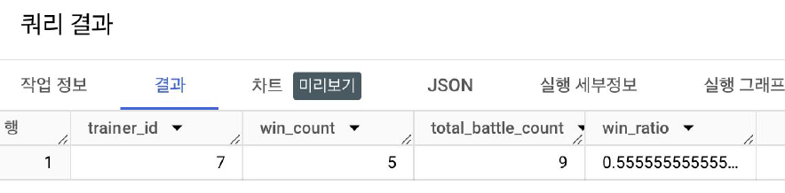

### 6) 맞다면 특정 유저 조건 제외
- WHERE의 trainer_id 제거 후, 총 배틀 횟수가 9 이상만 조건
```js
WITH battle_basic AS (
  SELECT
    ... # 길어져서 생략
  FROM 'basic.battle'
), battle_with_result AS (
SELECT
  *,
  CASE
    WHEN trainer_id = winner_id THEN "WIN"
    WHEN winner_id IS NULL THEN "DRAW"
    ELSE "LOSE"
  END AS battle_result
FROM battle_basic
# WHERE trainer_id = 7 주석 처리
)

SELECT
  trainer_id,
  COUNTIF(battle_result = "WIN") AS win_count,
  COUNT(battle_id) AS total_battle_count,
  COUNTIF(battle_result = "WIN") / COUNT(DISTINCT battle_id) AS win_ratio
FROM battle_with_result
GROUP BY
  trainer_id
HAVING
  total_battle_count >= 9  
```
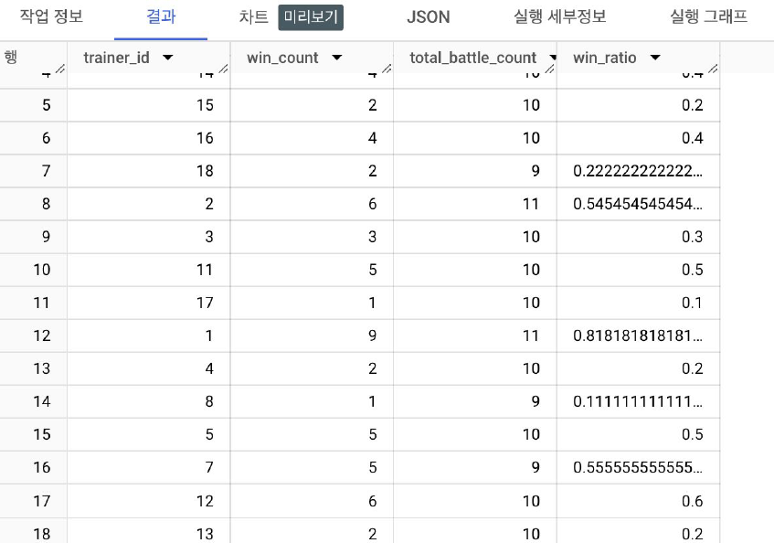

- trainer_id = 7인 경우엔 동일
- 나머지 trainer_id도 확인 후에 쿼리 확정

### 이 예시에서 예상한 결과
- trainer_id = 7일 때 배틀의 횟수 : 9
- 승리한 횟수 : 5
- 승리한 비율 : 0.55555...


## 과제 인증샷
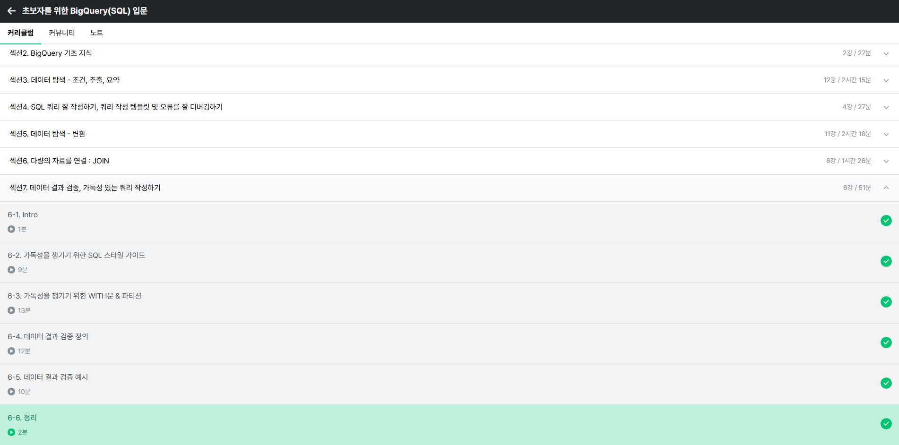