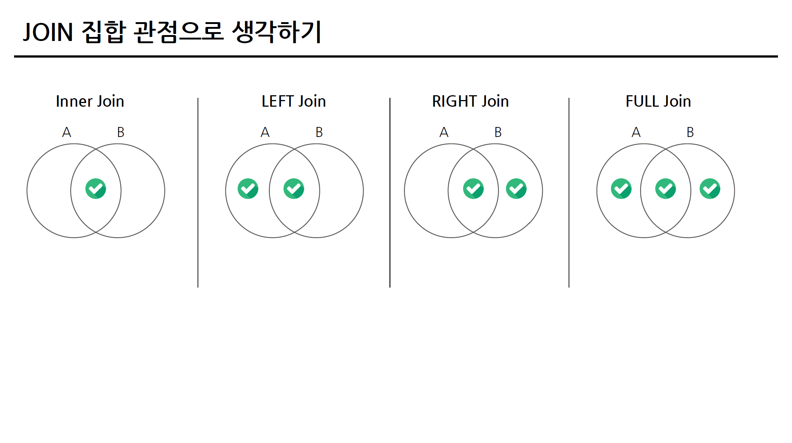
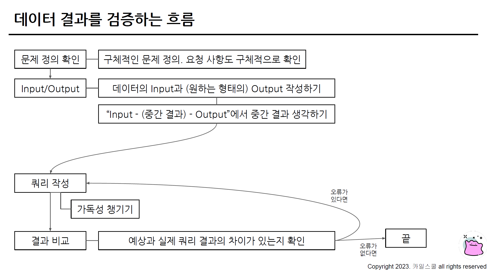

## 1. 총 정리 문제 풀이

### 1) 각 트레이너별로 가진 포켓몬의 평균 레벨을 계산하고, 그 중 평균 레벨이 높은 TOP 3 트레이너의 이름과 보유한 포켓몬의 수, 평균 레벨을 출력해주세요.
- 쿼리를 작성하는 목표, 확인할 지표: 트레이너의 이름, 보유한 포켓몬의 수, 평균 레벨
- 쿼리 계산 방법: 트레이너가 보유한 포켓몬의 수, 평균 레벨을 계산 + 트레이너 테이블과 연결해서 트레이너의 이름을 출력
- 데이터의 기간: X
- 사용할 테이블: trainer_pokemon, trainer
- Join KEY: trainer_pokemon.trainer_id = trainer.id
- 데이터 특징: trainer_pokemon의 status => Released는 방출

```js
WITH trainer_avg_level AS (
  SELECT
    trainer_id,
    AVG(level) AS avg_level,
    COUNT(id) AS pokemon_cnt
  FROM basic.trainer_pokemon
  WHERE
    status != "Released"
  GROUP BY
    trainer_id
)

SELECT
  DISTINCT
    t.name
    tal.avg_level,
    tal.pokemon_cnt
FROM basic.trainer AS t
LEFT JOIN trainer_avg_level AS tal
ON t.id = tal.trainer_id
ORDER BY
  avg_level DESC
LIMIT 3
```

### 2) 각 포켓몬 타입 1을 기준으로 가장 많이 포획된(방출 여부 상관없음) 포켓몬의 타입 1, 포켓몬의 이름과 포획 횟수를 출력해주세요.
- 쿼리를 작성하는 목표, 확인할 지표: 포켓몬 타입1, 포켓몬 이름, 포켓몬의 포획 횟수
- 쿼리 계산 방법: trainer_pokemon + pokemon type1, kor_name
- 데이터의 기간: X
- 사용할 테이블: trainer_pokemon, pokemon
- Join KEY: trainer_pokemon.trainer_id = pokemon.id
- 데이터 특징: X

```js
SELECT
  type1,
  kor_name,
  COUNT(tp.id) AS cnt
FROM basic.trainer_pokemon AS tp
LEFT JOIN basic.pokemon AS p
ON tp.pokemon_id = p.id
GROUP BY
  type1,
  kor_name
ORDER BY
  cnt DESC
LIMIT 3
```

### 3) 전설의 포켓몬을 보유한 트레이너들은 전설의 포켓몬과 일반 포켓몬을 얼마나 보유하고 있을까요? (트레이너의 이름을 같이 출력해주세요)
- 쿼리를 작성하는 목표, 확인할 지표: 트레이너마다 전설의 포켓몬을 얼마나 보유하고 있는가? 일반 포켓몬을 얼마나 가지고 있는가?
- 쿼리 계산 방법: trainer_pokemon + pokemon => 전설 T/F => 전설 여부에 따라 얼마나 있는지 COUNT. + trainer JOIN 이름을 출력
- 데이터의 기간: X
- 사용할 테이블: trainer_pokemon, pokemon, trainer
- Join KEY: trainer_pokemon.trainer_id = pokemon.id, (  ).trainer_id = trainer.id
- 데이터 특징: 전설 여부에 따라서 COUNT를 해야 한다! => COUNTIF, SUM(CASE WHEN ~)

```js
WITH AS legendary_cnts AS (
  SELECT
    tp.trainer_id,
    SUM(CASE WHEN p.is_legendary (IS TRUE) THEN 1 ELSE 0 END) AS legendary_cnt,
    SUM(CASE WHEN (NOT) p.is_legendary (IS NOT TRUE) THEN 1 ELSE 0 END) AS normal_true
  FROM basic.trainer_pokemon AS tp
  LEFT JOIN basic.pokemon AS p
  ON tp.pokemon_id = p.id
  WHERE tp.status IN ("Active", "Training")
  GROUP BY
    tp.trainer_id
)

SELECT
  t.name AS trainer_name,
  lc.legendary_cnt,
  lc.normal_cnt
FROM basic.trainer AS t
LEFT JOIN legendary_cnts AS lc
ON t.id = lc.trainer_id
WHERE
  lc.legendary_cnt >= 1
```

### 4) 가장 승리가 많은 트레이너 ID, 트레이너의 이름, 승리한 횟수, 보유한 포켓몬의 수, 평균 포켓몬의 레벨을 출력해주세요. 단, 포켓몬의 레벨은 소수점 2째 자리에서 반올림해주세요.
- 쿼리를 작성하는 목표, 확인할 지표: 가장 승리가 많은 트레이너, 트레이너 이름, 승리 횟수, 보유한 포켓몬 수, 평균 포켓몬 레벨
- 쿼리 계산 방법: battle 테이블 => winner_id, 승리 횟수를 COUNT + 트레이너 이름 + trainer_pokemon의 포켓몬 수, 포켓몬 레벨
- 데이터의 기간: X
- 사용할 테이블: battle, trainer, trainer_pokemon
- Join KEY: battle.winner_id = trainer.id => (  ).trainer_id = trainer_pokemon.trainer_id
- 데이터 특징: battle 테이블을 확인하면서 쿼리해야겠다!

```js
WITH winner_counts AS (
  SELECT
    winner_id,
    COUNT(winner_id) AS win_counts
  FROM basic.battle
  WHERE
    winner_id IS NOT NULL
  LEFT JOIN basic.pokemon AS p
  ON tp.pokemon_id = p.id
  GROUP BY
    winner_id
), top_winner AS (
  SELECT
    wc.winner_id AS trainer_id,
    wc.win_counts,
    t.name AS trainer_name
  FROM winner_counts AS wc
  LEFT JOIN basic.trainer AS t
  ON wc.winner_id = t.id
  ORDER BY
    win_counts DESC
  LIMIT 1
)

SELECT
  tw.trainer_id,
  tw.trainer_name,
  tw.win_counts
  COUNT(tp.pokemon_id) AS pokemon_cnt,
  ROUNT(AVG(tp.level), 2) AS avg_level
FROM top_winner AS tw
LEFT JOIN basic.trainer_pokemon AS tp
ON tw.trainer_id = tp.trainer_id
WHERE
  tp.status IN ("Active", "Training")
GROUP BY
  tw.trainer_id,
  tw.trainer_name,
  tw.win_counts
```

### 5) 트레이너가 잡았던 포켓몬의 총 공격력(attack)과 방어력(defense)의 합을 계산하고, 이 합이 가장 높은 트레이너를 찾으세요.
- 쿼리를 작성하는 목표, 확인할 지표: 트레이너 포켓몬의 총 (공격+방어) 공방
- 쿼리 계산 방법: trainer_pokemon => pokemon. attack + defense
- 데이터의 기간: X
- 사용할 테이블: trainer_pokemon, pokemon, trainer
- Join KEY: trainer_pokemon.pokemon_id = pokemon.id
- 데이터 특징: X

```js
WITH total_stats AS (
  SELECT
    tp.trainer_id,
    SUM(p.attack + p.defense) AS total_stat
  FROM basic.trainer_pokemon AS tp
  LEFT JOIN basic.pokemon AS p
  ON tp.pokemon_id = p.id
  GROUP BY
    tp.trainer_id
)

SELECT
  t.name,
  ts.trainer_id,
  ts.total_stat
FROM total_stats AS ts
LEFT JOIN basic.trainer AS t
ON ts.trainer_id = t.id
ORDER BY
  total_stat DESC
LIMIT 1
```

### 6) 각 포켓몬의 최고 레벨과 최저 레벨을 계산하고, 레벨 차이가 가장 큰 포켓몬의 이름을 출력하세요.
- 쿼리를 작성하는 목표, 확인할 지표: 포켓몬의 레벨 차이(최고 레벨 - 최저 레벨)
- 쿼리 계산 방법: trainer_pokemon에서 포켓몬의 최고 레벨, 최저 레벨을 계산 -> 차이를 구하고 -> 차이가 큰 순으로 정렬
- 데이터의 기간: X
- 사용할 테이블: trainer_pokemon, pokemon
- Join KEY: trainer_pokemon.pokemon_id = pokemon_id
- 데이터 특징: X

```js
WITH level_diff AS (
  SELECT
    tp.pokemon_id,
    MIN(tp.level) AS min_level,
    MAX(tp.level) AS max_level,
    MAX(tp.level) - MIN(tp.level) AS level_difference
  FROM basic.trainer_pokemon AS tp
  LEFT JOIN basic.pokemon AS p
  ON tp.pokemon_id = p.id
  GROUP BY
    tp.pokemon_id,
    p.kor_name
)

SELECT
  kor_name,
  level_difference
FROM level_diff
ORDER BY
  level_difference DESC
LIMIT 1
```

### 7) 각 트레이너가 가진 포켓몬 중에서 공격력(attack)이 100 이상인 포켓몬과 100 미만인 포켓몬의 수를 각각 계산해주세요. 트레이너의 이름과 두 조건에 해당하는 포켓몬의 수를 출력해주세요.
- 쿼리를 작성하는 목표, 확인할 지표: 트레이너의 이름 | 공격력이 100 이상인 포켓몬의 수 | 100 미만인 포켓몬의 수
- 쿼리 계산 방법: COUNTIF
- 데이터의 기간: X
- 사용할 테이블: trainer_pokemon, trainer
- Join KEY: trainer_pokemon.trainer_id = trainer_id
- 데이터 특징: 보유한 포켓몬!

```js
WITH active_and_training_pokemon AS (
  SELECT
    *
  FROM basic.trainer_pokemon
  WHERE
    status IN ("Active", "Training")
), trainer_high_and_low_attack_cnt AS (
  SELECT
    atp.trainer_id,
    COUNTIF(p.attack >= 100) AS high_attack_cnt,
    COUNTIF(p.attack < 100) AS low_attack_cnt
  FROM active_and_training_pokemon AS atp
  LEFT JOIN basic.pokemon AS p
  ON atp.pokemon_id = p.id
  GROUP BY
    atp.trainer_id
)

SELECT
  t.name,
  thala.*
FROM trainer_high_and_low_attack_cnt AS thala
LEFT JOIN basic.trainer AS t
ON thala.trainer_id = t.id
```


## 2. 강의를 마치며 학습 내용 전체 총 정리

### 초보자를 위한 BigQuery(SQL) 입문 총 정리
- 데이터 활용 과정
- 데이터 탐색: 조건과 추출
- 데이터 탐색: 요약, 집계
- SQL 쿼리 작성하는 흐름
    - 쿼리 작성 템플릿, 생산성 도구
    - 오류를 디버깅하는 방법
- 데이터 탐색: 변환
    - 데이터 타입과 타입별 함수
    - BigQuery 공식 문서 확인하는 방법
- 다양한 자료를 연결: JOIN
- 데이터 결과 검증
    - 가독성을 챙기기 위한 SQL 스타일 가이드

### BigQuery(입문) 총 정리


### BigQuery Query문 구조
```js
WITH CTE AS (
  SELECT
    col1,
    col2
  FROM Table
)

SELECT
  a.col3,
  b.col4,
  COUNT(DISTINCT a.id) AS cnt
FROM table_a AS a
LEFT JOIN table_b AS b
ON a.id = b.id
WHERE
  a.col3 >= 3
GROUP BY
  a.col3,
  b.col4
HAVING
  cnt >= 2
ORDER BY cnt DESC
LIMIT 10
```

### 데이터 타입
- 숫자
- 문자
- 시간, 날짜
- 부울(Bool)

### 쿼리 작성 템플릿
- 쿼리를 작성하는 목표, 확인할 지표:
- 쿼리 계산 방법:
- 데이터의 기간:
- 사용할 테이블:
- Join KEY:
- 데이터 특징:

```js
SELECT

FROM
WHERE
```

### 다양한 SQL JOIN 방법


### JOIN 집합 관점으로 생각하기


### SQL JOIN 쿼리 작성하는 흐름


### 오류 메시지 해결의 핵심


### 데이터 결과를 검증하는 흐름


### 앞으로 배우면 좋은 내용
- 복잡한 자료형 다루기: ARRAY, STRUCT
- 복잡한 데이터 가공하기
- BigQuery 결과를 스프레드시트, BI에 연동하기
- 유용한 변환 함수(윈도우 함수 등)
- 유용한 기능(스크립팅 등)


## 과제 인증샷
