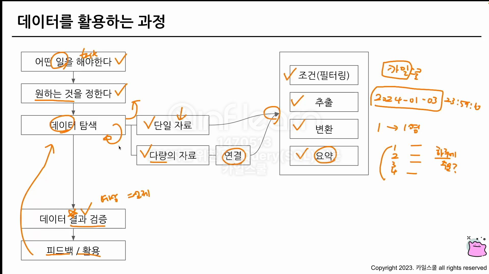
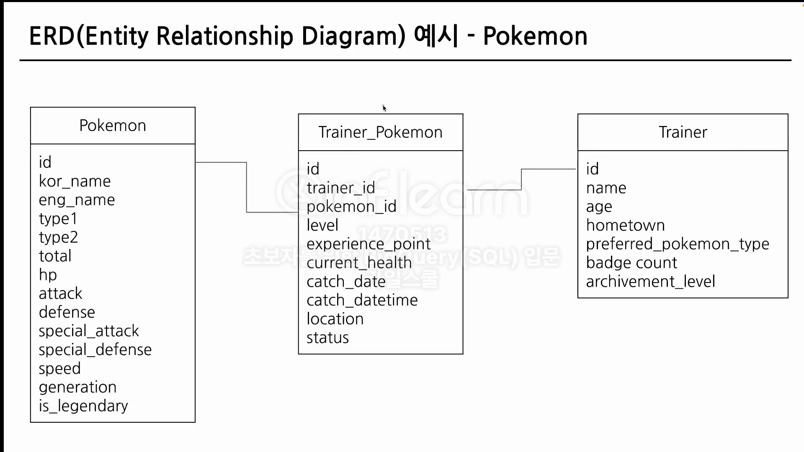
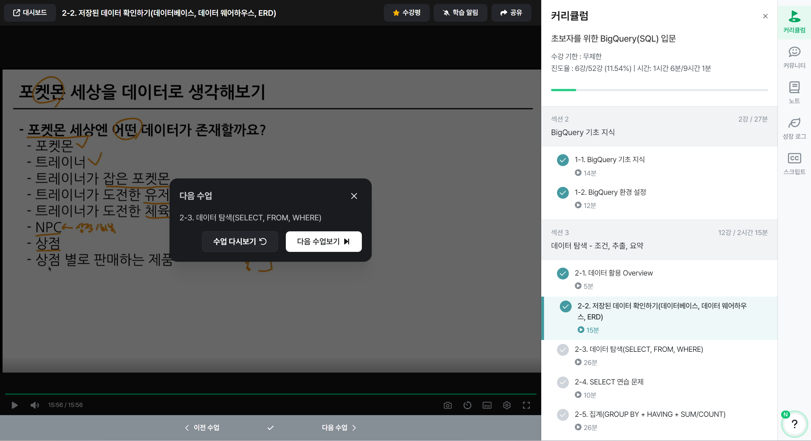

# SQL Assignment 1주차

## 1. BigQuery 기초 지식

### 데이터 저장 형태
- **Database:** 데이터의 저장소
- **Table:** 데이터가 저장된 공간

### OLTP(Online Transaction Processing)
- 거래를 하기 위해 사용되는 데이터베이스
- 보류, 중간 상태가 없음 - 주문을 완료하거나 안하거나 : 데이터가 무결하다
- 데이터의 추가(INSERT), 변경(UPDATE)이 많이 발생 
- SQL 사용해 데이터를 추출할 수 있으나, 분석을 위해 만든 데이터베이스가 아니라 쿼리 속도가 느릴 수 있음

### SQL(Structured Query Language)
- 데이터베이스에서 데이터를 가지고 올 때 사용하는 언어
- 데이터베이스의 데이터를 관리하기 위해 설계된 특수 목적의 프로그래밍 언어

### 테이블에 저장된 데이터의 형태
**테이블 구조** 
행(Row) →: 
- 하나의 row가 하나의 고유한 데이터
- (주의) Raw 데이터: 원본 데이터

열(Column) ↓: 
- 각 데이터의 특정 속성 값

### OLAP(Online Analytical Processing):
- OLTP로 데이터 분석을 하다가 속도, 기능 부족의 이슈로 OLAP 등장
- 분석을 위한 기능 제공

### 데이터 웨어하우스:
- 데이터를 한 곳에 모아서 저장
- 여러 곳에 저장된 데이터 예시 (Database, 웹(크롤링), 파일, API의 결과 등)

### BigQuery
Google Cloud의 OLAP + 데이터 웨어하우스

**장점**
1. 난이도
- SQL을 사용해 쉽게 데이터 추출 가능
2. 속도
- OLAP 도구이므로 속도가 빠름(단, 그만큼 돈을 지불)
3. Firebase, Google Analytics 4의 데이터를 쉽게 추출할 수 있음
- 사용 기기, 위치(시 단위까지 표현), OS 버전, 이벤트 행동 획득 가능(별도의 로깅 필요)
4. 데이터 웨어하우스를 사용하기 위해 서버(컴퓨터)를 띄울 필요 없음
- 구글에서 인프라를 관리

**사용하는 이유**
- 회사에서 앱이나 웹에서 Firebase, Google Analytics 4를 활용할 경우
- 운영을 적은 비용(인력 등)으로 진행하기 위해 

**비용** 
쿼리 비용(Compute Pricing):
- On-demand 요금제: 쿼리에서 처리된 용량만큼 부과
- Capacity 요금제: Slot 단위로 요금 부과

저장 비용(Storage Pricing):
- Active Logical 저장소
- Long-term Logical 저장소

## 2. BigQuery 환경 설정

### BigQuery의 환경 구성 요소
**1. 프로젝트(Project)**
- 하나의 큰 컨물. 건물 안에는 여러 목적을 가진 창고가 존재
- 하나의 프로젝트 내에 여러 데이터셋이 존재할 수 있음

**2. 데이터셋(Dataset)**
- 프로젝트에 있는 창고. 각 창고 공간에 데이터를 저장
- 판매 데이터, 고객 데이터 등 별도의 데이터 저장할 수 있음
- 하나의 데이터셋에 다양한 테이블 존재할 수 있음

**3. 테이블(Table)**
- 창고에 있는 선반
- 테이블 안에는 상품의 세부 정보가 저장
- 테이블 안에 행과 열로 이루어진 데이터들이 저장

## 3. 데이터 활용 Overview
**데이터를 활용하는 과정**

> - 문제 정의 -> **MECE(Mutually Exclusive and Collectively Exhaustive):** 중복이 없고 상호배제적
> - 지표 정의 -> **Metric**

## 4. 저장된 데이터 확인하기

### SQL 쿼리를 작성하기 전에
- 데이터가 어떻게 저장되어 있는가?에 대해 생각해보기
- 어떤 데이터가 저장되어 있는가?
- 컬럼의 의미는 무엇인가?
> 데이터를 제대로 이해해야 올바른 데이터를 추출할 수 있음(구체적인 정의를 항상 확인하면서 쿼리를 작성해야 함)

### 데이터가 저장되는 형태를 알려면?
**ERD(Entity Relationship Diagram):** 데이터베이스 구조를 한눈에 알아보기 위해 사용

> ERD가 없다면 모든 데이터 베이스를 직접 보면서 탐색해보기
> - 어떤 **테이블**이 존재하는가?
> - 어떤 **컬럼**이 존재하는가?
> - 다른 테이블과 **연결**할 때 어떤 컬럼을 사용하는가?
> - 컬럼의 값들은 **어떤 의미**를 가지는가?
>
> 스프레드시트나 문서로 따로 정리해두기

### 회사에 존재할 수 있는 데이터
1. 서비스에 사용될 데이터베이스
2. 앱/웹 로그 데이터
3. 공공 데이터, 서드파티 데이터

### ERD 예시 - Pokemon

> **포켓몬 세상 데이터**
> - 포켓몬
> - 트레이너
> - 트레이너가 잡은 포켓몬
> - 트레이너가 도전한 유저 배틀
> - 트레이너가 도전한 체육관 배틀
> - NPC
> - 상점
> - 상점별로 판매하는 제품

> **이커머스 산업 데이터**
> - 포켓몬 : 상품
> - 트레이너 : 유저
> - 트레이너가 잡은 포켓몬 : 주문
> - 장바구니에 담은 물건
> - 웹페이지 접근 수
> - 웹페이지의 버튼 클릭 수

## 과제 인증샷

