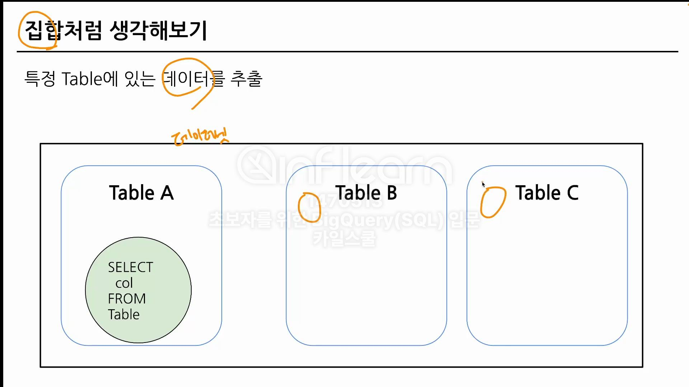
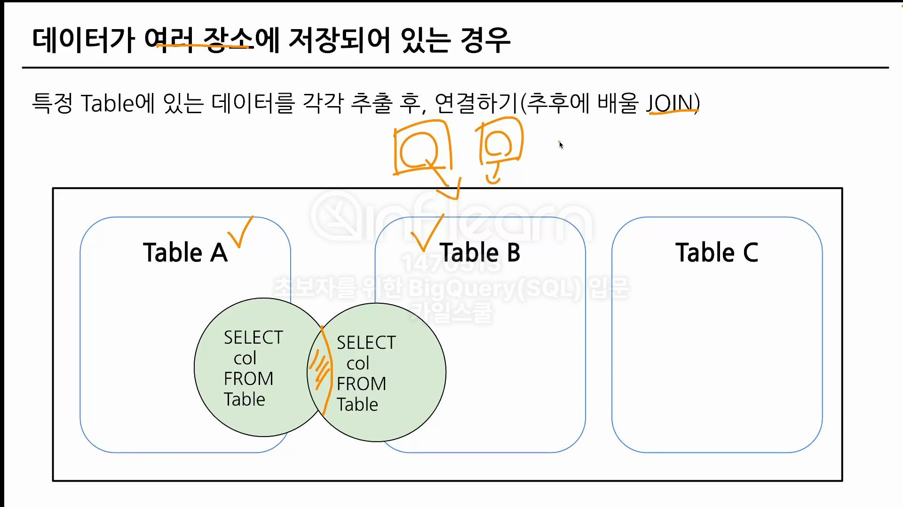
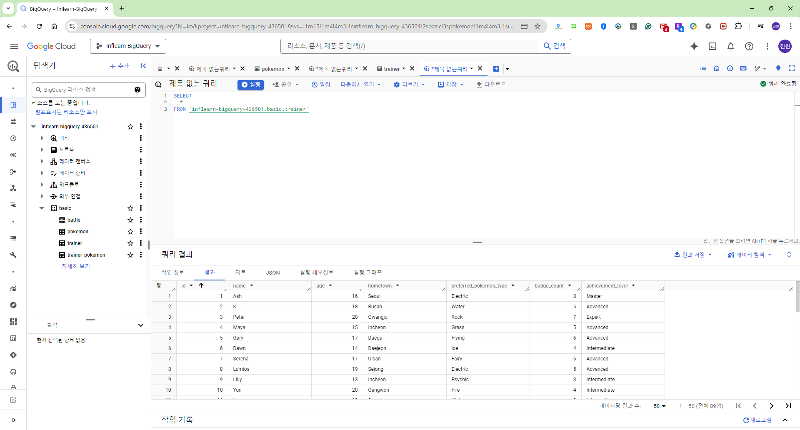
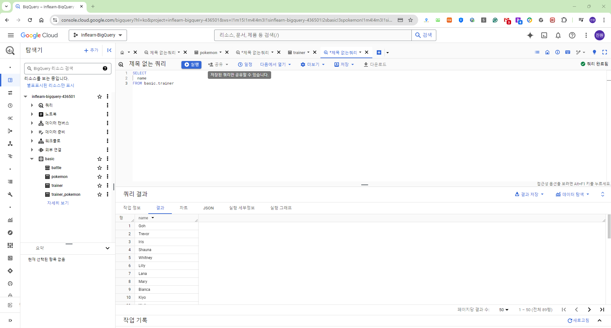
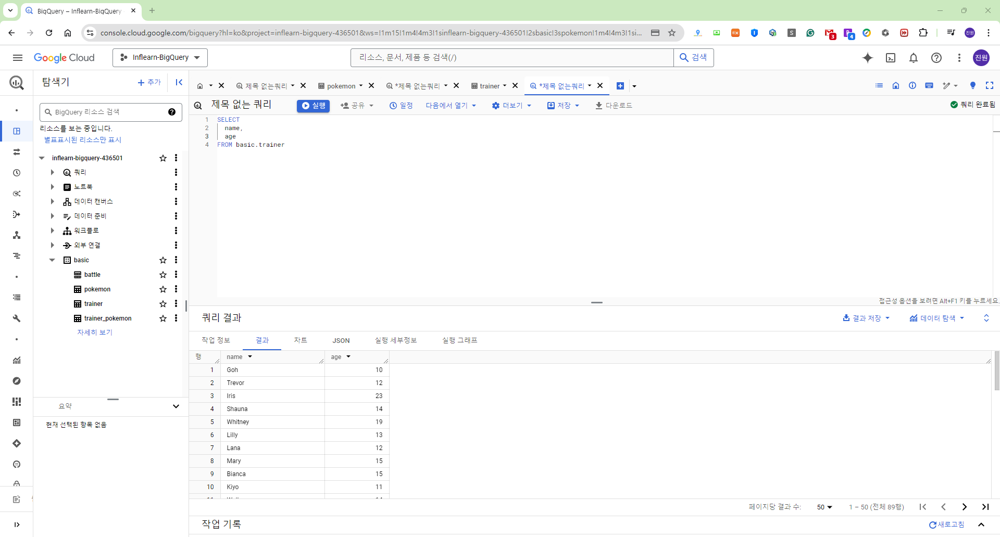
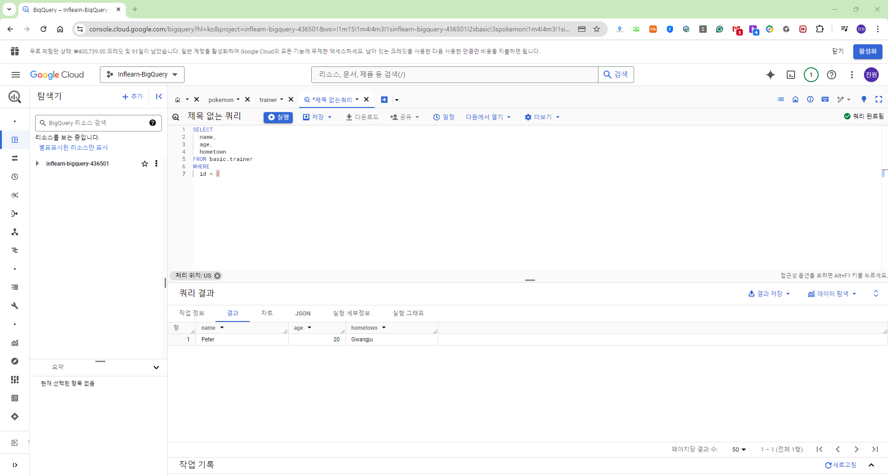
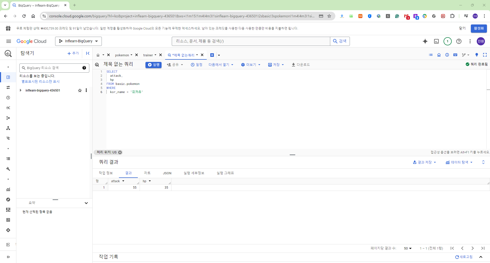

# SQL Assignment 2주차

## 1. 데이터 탐색(SELECT, FROM, WHERE)

### SQL 쿼리 구조
우선 SELECT, FROM, WHERE 
> SELECT 
&ensp; Col1 AS new_name, 
&ensp; Col2, 
&ensp; Col3 
FROM Dataset.Table : 어떤 테이블에서 데이터를 확인할 것인가? 
WHERE : 만약 원하는 조건이 있다면 어떤 조건인가? 
&ensp; Col = 1 : 조건문
>
> **\*** : 모든 컬럼을 출력하겠다. 
SELECT 
&ensp; \* EXCEPT (제외할 컬럼) 
이런 형태도 가능

**이 순서를 꼭 기억하기! (SELECT - FROM - WHERE)**

### 집합처럼 생각해보기
특정 Table에 있는 데이터를 추출

### 데이터가 여러 장소에 저장되어 있는 경우
특정 Table에 잇는 데이터를 각각 추출 후, 연결하기(추후에 배울 JOIN)

### BigQuery 작성 가이드
> inflearn-bigquery: 프로젝트 id 
> basic: dataset 
> pokemon: table 
> '<프로젝트 id>.<데이터셋>.<테이블>' 

- 프로젝트 id는 꼭 명시할 필요는 없을 수도 있음(프로젝트가 단일이라면!)
- 프로젝트를 여러개 사용한다면 명시하는 것이 좋음 => 쿼리를 실행할 때 어떤 프로젝트인지 확인하는 과정이 존재
- 프로젝트 명시 => 불편
- 프로젝트를 제외하고 사용해도 괜찮긴 함(여러 프로젝트를 쓸 때는 명시해야 한다)
- 프로젝트 id를 제외하고 작성할 때는 없어도 괜찮음
- 데이터를 활용하고 싶은 목적이 있어야 어떤 칼럼을 선택할지 알 수 있게 됨

### 가독성 있는 쿼리
- 쿼리를 잘 읽을 수 있으려면 잘 작성해야 함 => 협업할 때 특히 중요

### SQL 문법 핵심 정리
1. **FROM:**
- 데이터를 확인할 Table 명시
- 이름이 너무 길다면 AS "별칭"으로 별칭 지정 가능
- FROM Table1 AS t1
2. **WHERE**
- FROM에 명시된 Table에 저장된 데이터를 필터링(조건 설정)
- Table에 있는 컬럼을 조건 설정
3. **SELECT**
- Table에 저장되어 있는 컬럼 선택
- 여러 컬럼 명시 가능
- col1 AS "별칭"으로 컬럼의 이름도 별칭 지정 가능

## 2. SELECT 연습 문제

### 1. trainer 테이블에 있는 모든 데이터를 보여주는 SQL 쿼리를 작성해주세요.
1) trainer 테이블에 어떤 데이터가 있는지 확인해보자
2) trainer 테이블을 어디에 명시해야 할까? => FROM
3) 필터링 조건이 있을까? => 모든 데이터 => 필터링을 할 필요가 없겠다
4) 모든 데이터 => 모든 데이터 = 모든 컬럼일 수도 있겠다(추측) 쿼리 작성 => 애매하면 모든 데이터의 정의가 무엇인가?

### 2. trainer 테이블에 있는 트레이너의 name을 출력하는 쿼리를 작성해주세요.
1) trainer 테이블 사용
2) name 컬럼을 사용

### 3. trainer 테이블에 있는 트레이너의 name, age를 출력하는 쿼리를 작성해주세요.
1) trainer 테이블 사용
2) 조건 설정 없음
3) name, age 컬럼 사용

### 4. trainer의 테이블에서 id가 3인 트레이너의 name, age, hometown을 출력하는 쿼리를 작성해주세요.
1) trainer 테이블 사용
2) 조건 설정 => id가 3인
3) 컬럼 : name, age, hometown

> - name, age, hometown => 영어로 명시되어 있는 경우엔 편함
> - 현업에서는 이름, 나이를 알려주세요 => 컬럼의 의미를 파악해서 작성해야 함 => 어떤 컬럼을 요구하는지, 어떤 컬럼을 봐야하는지?

### 5. pokemon 테이블에서 "피카츄"의 공격력과 체력을 확인할 수 있는 쿼리를 작성해주세요.
1) pokemon 테이블
2) 조건? = "피카츄" kor_name = "피카츄"
3) 공격력, 체력 => 테이블에서 어떤 컬럼인지 확인해야 함 => attack, hp

## 3. 집계(GROUP BY + HAVING + SUM/COUNT)

